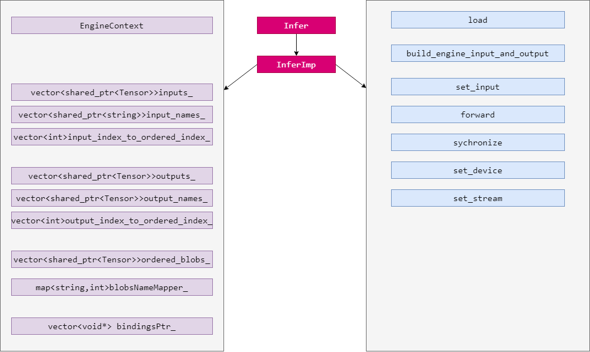

# 1 概述

推理框架封装实现，实现AI模型快速推理部署，封装的目的在于：

- 掌控细节、技术沉淀；
- 代码复用、快速开发；


## 1.1 优势

1. 预处理和后处理加速：CUDA编程；
2. 动态Batch：提高推理并行度；
3. 独占资源分配器：防止内存溢出；
4. 预处理和推理并行：prefetch思想；
5. 封装Tensor：内存复用，避免重复开辟释放；
6. 推理任务非阻塞：C++`promise+future`实现；
7. 设计模式：生产消费+RAII+接口设计模式，推理稳定运行；

## 1.2 流程描述

1. `parse_raw`从接口解析数据流，获取输入`image(cv::Mat)`;
2. 通过commit提交方法，将输入`image`打包成job，并返回一个未完成推理任务`future`；
3. 预处理内存准备：申请独占数据资源`preprocecss Tensor`，包含两个混合内存Mixmemory，每个Mixmemory由一份CPU内存和一份GPU内存组成；若独占资源不足时，等待，从而实现过载推理防内存溢出功能；
4. 内存拷贝：将输入图像和仿射变换矩阵由分页内存拷贝至workspace页锁定内存；
5. 内存拷贝：将页锁定内存拷贝至workspace的GPU显存；
6. 预处理：CUDA核函数对workspace中图像执行具体的仿射变换，并将预处理结果存储在Data混合内存的GPU显存中;
7. 组合batch：将现有所有job的预处理结果拷贝到与tensorRT绑定的输入GPU显存中，组成成batch，实现动态shape；
8. 推理：tensorRT通过enqueueV2推理，结果存储在`out_tensor`的显存中；
9. 后处理：使用cuda核函数对模型推理结果执行后处理操作，结果保存在`post tensor`的显存中；
10. 内存拷贝：将后处理结果从显存拷贝至CPU内存，获取最终输出output；
11. 结果返回：future通过`set_result`方法填充output，并将future未完成工作，设置为已完成；接口判断future完成状态可通过`get`方法获取推理结果；

#  2 TensorRT基础

## 2.1 概述

TensorRT是基于NVIDIA GPU的推理引擎，其核心是对模型算子的优化（合并算子、利用GPU特性选择特定核函数等多种策略），需要在目标GPU上实际运行的方式选择最优算法和配置，因此tensorRT生成的模型只能在特定条件下运行（编译的trt版本、cuda版本、编译时的GPU型号），其主要内容分为三个方面：

- 模型结构定义方式；

- 编译过程配置；
- 推理实现；

**模型结构定义方式**

模型结构定义方式大致分为三类，其一，根据tensorRT原生API重写模型，耗时费力；其二，从开源项目中复用写好的tensorRT模型结构，可选有限；其三，tensorRT解析ONNX模型文件，修改灵活，易于移植到其他平台，如ncnn，rknn；

因此，推荐的tensorRT推理实现路线是：


**tesnorRT库文件一览**


**编译和推理流程图**


## 2.2 环境

tensorRT整套环境应包含tensorRT、cuda、cudnn、protobuf；可使用trtpy快速配置；

```shell
# 安装trtpy 
pip install trtpy -U

# 配置快捷指令
echo alias trtpy=\"python -m trtpy\" >> ~/.bashrc
source ~/.bashrc

# 配置密匙
trtpy set-key sxaiwgroup

# 根据当前显卡驱动环境，自动选择tensorRT版本安装
trtpy get-env

# 若想指定tensorRT版本，则进入trtpy package的__init__查看版本组合, 进入__main__文件配置args参数，例如

def do_get_env(args):
    print("args:", args)
    args.trt = "8.0.3.4"
    trtpy.init(cuda_version=args.cuda, tensorrt_version=args.trt, load_lean_library=False)
	...
```

## 2.3 编译

**编译基本步骤**：

1. 定义日志类，TRTLogger，继承自nvinfer1:ILogger，可以记录tensorRT编译过程中出现发生任何事情，可重写log方法设置打印的日志级别，用于错误的排查的调试；
2. 创建编译器：builder；max_batch_size是在builder->setMaxBatchSize中设置；
3. 创建配置实例：config，用于设置编译的各种参数，例如batch_size，数据类型（fp32、fp16、int8等）；
4. 创建网络实例：network，createNetworkV2(1)是目前推荐创建方法，1表示显性batch;
5. 编译：输入network和config，builder编译输出推理引擎；
6. 序列化：编译生成的推理引擎，可以序列化保存成文件储存；

**编译注意事项：**

1. 必须使用createNetworkV2，并指定为1（表示显性batch）。createNetwork已经废弃，非显性batch官方不推荐。这个方式直接影响推理时enqueue还是enqueueV2;
2. builder、config等指针，记得释放，否则会有内存泄漏，使用ptr->destroy()释放;
3. markOutput表示是该模型的输出节点，mark几次，就有几个输出，addInput几次就有几个输入。这与推理时相呼应;
4. workspaceSize是工作空间大小，某些layer需要使用额外存储时，不会自己分配空间，而是为了内存复用，直接找tensorRT要workspace空间。指的这个意思;
4. build通过profile->setDimensions设置动态shape;
5. 一定要记住，保存的模型只能适配编译时的trt版本、编译时指定的设备。也只能保证在这种配置下是最优的。如果用trt跨不同设备执行，有时候可以运行，但不是最优的，也不推荐;

**编译代码描述：**

```cpp
// 重写ILogger的log方法
class TRTLogger : public nvinfer1::ILogger
{
public:
    virtual void log(Severity severity, nvinfer1::AsciiChar const *msg) noexcept override
    {
        if (severity <= Severity::kINFO)
        {
            printf("%d: %s\n", severity, msg);
        }
    }
}

// 初始化权重，权重存储在一维连续空间
nvinfer1::Weights make_weights(float *ptr, int n)
{
    nvinfer1::Weights w;
    w.count = n;
    w.type = nvinfer1::DataType::kFLOAT;
    w.values = ptr;
    return w;
}

int build_engine()
{
    // -----------------------------------创建对象-----------------------------------
    TRTLogger logger;    
    nvinfer1::IBuilder* builder = nvinfer1::createInferBuilder(logger);
    nvinfer1::IBuilderConfig* config = builder->createBuilderConfig();
    nvinfer1::INetworkDefinition* network = builder->createNetworkV2(1); // 显性batch

    
   	// -----------------------------------搭建模型-----------------------------------
    const int num_input = 3;
    const int num_output = 2;
    float layer1_weight_values[] = {1.0, 2.0, 0.5, 0.1, 0.2, 0.5};
    float layer1_bias_values[] = {0.3, 0.8};

    nvinfer1::ITensor *input = network->addInput("image", nvinfer1::DataType::kFLOAT, nvinfer1::Dims4(1, num_input, 1, 1));
    nvinfer1::Weights layer1_weight = make_weights(layer1_weight_values, 6);
    nvinfer1::Weights layer1_bias = make_weights(layer1_bias_values, 2);
    auto layer1 = network->addFullyConnected(*input, num_output, layer1_weight, layer1_bias);
    auto prob = network->addActivation(*layer1->getOutput(0), nvinfer1::ActivationType::kSIGMOID);
    network->markOutput(*prob->getOutput(0));  // 将我们需要的prob标记为输出
    
    
    // ---------------------------------构建推理引擎---------------------------------
    builder->setMaxBatchSize(1);           // 最大BatchSize
    config->setMaxWorkspaceSize(1 << 30);  // tensorRT工作空间，内存复用, 默认1<<30 1G, 显存不足时应适当减小
    
    /* 编译动态shape配置方法
    auto profile = builder->createOptimizationProfile();
    for(int i=0;i<net_num_input;++i){
        auto input = network->getInput(i);
        auto input_dims = input->getDimensions();
        input_dims.d[0]=1;
        profile->setDimensions(input->getName(), nvinfer1::OptProfileSelector::kMIN, input_dims);
        profile->setDimensions(input->getName(), nvinfer1::OptProfileSelector::kOPT, input_dims);
        input_dims.d[0]=max_batch_size
        profile->setDimensions(input->getName(), nvinfer1::OptProfileSelector::MAX, input_dims);
    }
    */
    
    
    nvinfer1::ICudaEngine *engine = builder->buildEngineWithConfig(*network, *config);
    if (engine == nullptr)
    {
        printf("Build engine failed.\n");
        return false;
    }

    // ---------------------------------将模型序列化储存---------------------------------
    nvinfer1::IHostMemory *model_data = engine->serialize();
    FILE *f = fopen("engine.trtmodel", "wb");
    fwrite(model_data->data(), 1, model_data->size(), f);
    fclose(f);
	
    // ------------------------------卸载顺序按照构建顺序倒序------------------------------
    model_data->destroy();
    engine->destroy();
    network->destroy();
    config->destroy();
    builder->destroy();
    printf("Done.\n");
	return 0;
}
```

## 2.4 推理

**推理的基本步骤：**

1. 定义一个日志类；
2. 创建运行实例：runtime;
3. 创建推理引擎实例：engine，由文件反序列化得到；
4. 创建推理上下文：execution_context；
5. 内存分配：在CPU、GPU上创建输入输出tensor，内存拷贝、CUDA流创建等；
6. 推理：将输入输出tensor放入bindings数组，一起送入执行上下文execution_comtext的enqueueV2方法进行推理；

**推理注意事项：**

1. bindings是tensorRT对输入输出张量的描述，bindings = input-tensor + output-tensor。比如input有a，output有b, c, d，那么bindings = [a, b, c, d]，bindings[0] = a，bindings[2] = c，其中a，b，c，d一般是float数组，bindings是二维数组，也即二级指针类型，此时看到engine->getBindingDimensions(0)获取的就是a。

2. enqueueV2是异步推理，加入到stream队列等待执行。输入的bindings则是tensors的指针（注意是device pointer）。其shape对应于编译时指定的输入输出的shape（这里只演示全部shape静态）

3. createExecutionContext可以执行多次，允许一个引擎具有多个执行上下文，不过看看就好，别当真；

**推理代码描述：**

```cpp
template <typename T>
static void load_file(const std::string &file, std::vector<T> &data)
{
    std::ifstream in(file, std::ios::in | std::ios::binary);
    if (!in.is_open())
        return;

    in.seekg(0, std::ios::end); // 将读指针从文件末尾开始偏移0个字节
    size_t length = in.tellg(); // 获取当前读指针偏移的字节数

    if (length > 0)
    {
        in.seekg(0, std::ios::beg);
        data.resize(length / sizeof(T)); // 避免多余元素
        in.read((char *)&data[0], length);
    }
    in.close();
}

void inference()
{
	// ------------------------------ 1. 准备模型并反序列化加载   ----------------------------
    auto engine_data = load_file<uint8_t>("engine.trtmodel");
    TRTLogger logger;
    nvinfer1::IRuntime *runtime = nvinfer1::createInferRuntime(logger);
    nvinfer1::ICudaEngine *engine = runtime->deserializeCudaEngine(engine_data.data(), engine_data.size());
    if (engine == nullptr)
    {
        printf("Deserialize cuda engine failed.\n");
        runtime->destroy();
        return;
    }
	
    // ------------------------------ 2. 配置CUDA流和CUDA输入输出内存 ----------------------------
    cudaStream_t stream;
    cudaStreamCreate(&stream);

    float input_data_host[] = {1, 2, 3};
    float *input_data_device = nullptr;

    float output_data_host[2];
    float *output_data_device = nullptr;
    cudaMalloc(&input_data_device, sizeof(input_data_host));
    cudaMalloc(&output_data_device, sizeof(output_data_host));
    cudaMemcpyAsync(input_data_device, input_data_host, sizeof(input_data_host), cudaMemcpyHostToDevice, stream);
    float *bindings[] = {input_data_device, output_data_device};

    // ------------------------------ 3. 推理并将结果搬运回CPU   ----------------------------
    nvinfer1::IExecutionContext *execution_context = engine->createExecutionContext(); // 构建推理上下文
    bool success = execution_context->enqueueV2((void **)bindings, stream, nullptr);   // 绑定输入输出推理
    cudaMemcpyAsync(output_data_host, output_data_device, sizeof(output_data_host), cudaMemcpyDeviceToHost, stream);  // 内存搬运
    cudaStreamSynchronize(stream);  // 同步
    printf("output_data_host = %f, %f\n", output_data_host[0], output_data_host[1]);
    printf("Clean memory\n");
    
    // ---------------------------- 4. 卸载顺序按照构建顺序倒序 --------------------------
    cudaStreamDestroy(stream);
    execution_context->destroy();
    engine->destroy();
    runtime->destroy();

    // ------------------------------ 5. 手动推理进行验证 ----------------------------
    const int num_input = 3;
    const int num_output = 2;
    float layer1_weight_values[] = {1.0, 2.0, 0.5, 0.1, 0.2, 0.5};
    float layer1_bias_values[] = {0.3, 0.8};

    printf("手动验证计算结果：\n");
    for (int io = 0; io < num_output; ++io)
    {
        float output_host = layer1_bias_values[io];
        for (int ii = 0; ii < num_input; ++ii)
        {
            output_host += layer1_weight_values[io * num_input + ii] * input_data_host[ii];
        }

        // sigmoid
        float prob = 1 / (1 + exp(-output_host));
        printf("output_prob[%d] = %f\n", io, prob);
    }
}
```

## 2.5 动态shape

动态shape是指输入尺寸动态不固定，例如batch_size，例如卷积的w和h，动态shape的实现需要在编译时设置动态变化范围，并在推理时明确输入的尺寸；

编译时，如果要使用动态shape，必须让NetworkDefinition的维度定义为-1，例如对于卷积操作，令batch_size、w、h三个维度为动态，channel为固定：

```cpp
// 1. 将输入的动态维度设置为-1
nvinfer1::ITensor* input = networt->addInput("in", nvinfer1::DataType::kFLOAT, nvinfer1::Dims4(-1,1,-1,-1));

// 2. 通过OptimizationProfile配置动态变化的范围
auto profile = builder->createOptimizationProfile();
profile->setDimemsions(input->getName(), nvinfer1::OptProfileSelector::kMIN, nvinfer1::Dims4(1,1,3,3));
profile->setDimemsions(input->getName(), nvinfer1::OptProfileSelector::kOPT, nvinfer1::Dims4(1,1,3,3));
profile->setDimensions(input->getName(), nvinfer1::OptProfileSelector::kMAX, nvinfer1::Dims4(maxBatchSize, num_input, 5, 5));
config->addOptimizationProfile(profile);
```

推理时，对于之前设置动态的维度，需要在进入推理队列前，明确输入的尺寸：

```cpp
// 明确输入的尺寸
nvinfer1::IExecutionContext* execution_context = engine->createExecutionContext();
execution_context->setBindingDimensions(0, nvinfer1::Dims4(ib, 1, ih, iw));
```

注意事项：

1. OptimizationProfile是一个优化配置文件，用来指定输入的shape可以变换的范围的，不要被优化两个字蒙蔽了双眼；
2. 如果onnx的输入某个维度是-1，表示该维度动态，否则表示该维度是明确的，明确维度的minDims, optDims, maxDims一定一样；
2. 使用中，大部分场景只关注batch的动态，宽高一般不使用动态；宽高动态影响引擎推理的很多因素，view、reshape、anchor等，且宽高动态在大多数实际应用中没有必要；
# 3 TensorRT封装

TensorRT封装目的在于实现开发效率的提升：

- 对推理引擎的封装，不仅仅是TensorRT，可以切换后端，例如TensorRT、openvino、onnxruntime等
- 技术沉淀，代码复用，掌控细节，快速开发；

## 3.1 编译的封装
## 3.2 内存封装

内存封装包括两个模块，底层封装mixmemory类实现内存管理，上层封装Tensor类实现内存数据读写；

### 3.2.1 内存管理

一次推理，经常涉及两对内存，输入内存对和输出内存对，每个内存对包括大小相同的GPU和CPU内存，且每次推理重复开辟和释放；

因此，通过封装Mixmemory类，管理一对内存，并通过内存持久化实现内存复用，避免重复开辟和释放；


- 设备切换：一个mixmemory实例关联一个设备Device ID，通过AutoDevice构造和析构实现设备上下文管理，便捷实现对指定设备进行内存操作。

- 内存管理：在使用中，由于cpu内存和gpu内存通常成对出现，因此，可以通过MixMemory封装同时管理一块CPU内存和一块GPU内存；
- 简单接口：输入内存大小，返回内存指针；内存分配、释放、设备切换均进行封装隐藏；
- 内存复用：对于主动开辟内存方式，支持内存动态拓展，若当前内存不足，则释放后，重新开辟；若内存满足要求，则无需重新开辟，提高了内存的复用性；引用内存方式，当内存不足时，不主动释放，也不重新开辟，应抛出异常；

`mixmemory`类成员变量：

```cpp
void *cpu_ = nullptr;
size_t cpu_size_ = 0;
bool owner_cpu_ = true;

void *gpu_ = nullptr;
size_t gpu_size_ = 0;
bool owner_gpu_ = true;
int device_id_ = 0;
```

在指定设备上主动开辟内存：采用懒分配，初始构造不开辟内存；但是，要判断指定设备ID是否有效，若未指定设备，则使用`cudaGetDevice`；

```cpp
MixMemory(int device_id = CURRENT_DEVICE_ID); //  #define CURRENT_DEVICE_ID -1
```

引用其他设备已开辟内存：

```cpp
MixMemory(void *cpu, size_t cpu_size, void *gpu, size_t gpu_size, int device_id = CURRENT_DEVICE_ID);
```

同样，判断指定设备ID是否有效；其二，判断内存指针和内存size有效性；

**关键点：**所有内存相关的CUDA操作，必须先切换到`device_id_`变量记录的设备，再执行；

### 3.2.1 内存数据读写

内存数据读写是通过Tensor类的封住实现的，每一个Tensor实例对应内存由Mixmemory实例管理，Tensor主要实现三项功能：

#### 数据在GPU和CPU之间拷贝

cuda计算基本流程：

1. 将输入数据从CPU拷贝到GPU；
2. GPU计算；
3. 将输出数据从GPU拷贝到CPU；

因此内存拷贝是Tensor最常用的功能；数据拷贝借鉴caffe思想，使用内存标记（Init/Device/Host）分别表示未分配内存、最新数据在CPU内存上，最新数据在GPU内存上；Init状态下，是没有数据的，它使tensor处于懒加载状态，即在使用内存时才进行分配。

例如，tensor.cpu接口表示获取最新数据，并将数据拷贝至CPU内存；tensor.gpu接口表示获取最新数据，并将数据拷贝至GPU内存；以tensor.cpu为例，其代码逻辑如下：


#### 索引计算

输入各维度索引，自动计算内存地址偏移量，从而访问数据；

```python
'''
tensor.shape->[B,D,C,H,W]
B	i
D	j
C	k
H	l
W	m	
'''
offset=0
for a,b in zip([B,D,C,H,W],[i,j,k,l,m,n]):
	offset*=a
    offset+=b
```

#### 序列化和反序列化

数据序列化为文件，C++和python均可以读取并使用。

一种使用场景：

在C++中开发后处理代码时，可以先在Python中将模型预测结果序列化为文件，在C++中使用Tensor封装反序列化，直接获取模型预测结果，进而仅需在C++中关注后处理逻辑，而不用在C++中实际的运行模型，模块化开发，易于调试。

## 3.3 推理的封装

推理器的思想可以应用到很多框架作为底层，并不限制于tensorRT，还可以是rknn，openvino；

### 3.3.1 推理引擎的封装

执行推理任务，必须搭建推理环境，EngineContext类封装一系列成员变量：运行时对象（日志）、反序列化后的推理引擎（模型）、推理上下文（任务队列）、CUDA流（计算执行设备）持久化、访问资源环境，通过成员方法build_model和destory实现推理环境的开辟和释放；


nvinfer推理涉及运行时对象IRuntime，基于IRuntime反序列化引擎文件获取ICudaEngine推理引擎对象，ICudaEngine创建推理上下文IExecutionContext，IExecutionContext通过enqueueV2添加异步推理任务，并在CUDA流stream中执行；

#### build_model

build_model用于分配推理相关所有资源，通过成员变量访问资源；

```cpp
// pdata,size即加载到内存的引擎文件；
bool build_model(const void *pdata, size_t size)
{
	destroy();

	if (pdata == nullptr || size == 0)
		return false;

	owner_stream_ = true;
	checkRuntime(cudaStreamCreate(&stream_));
	if (stream_ == nullptr)
		return false;

	runtime_ = make_nvshared(createInferRuntime(gLogger));
	if (runtime_ == nullptr)
		return false;

	engine_ = make_nvshared(runtime_->deserializeCudaEngine(pdata, size, nullptr));
	if (engine_ == nullptr)
		return false;

	context_ = make_nvshared(engine_->createExecutionContext());
	return context_ != nullptr;
}
```

在分配一个新的推理环境时（加载模型，创建上下文），默认创建并使用当前设备的CUDA流；

#### destory

EngineContext成员变量管理推理相关所有资源，destory用于释放所有资源；

```cpp
/*
IRuntime、ICudaEngine、IExcutionContext作为nvinfer对象是通过destory方法释放资源；
封装采用共享指针管理，在创建时，已指定删除器，见make_nvshared函数；因此，释放资源只需要reset共享指针，若引用计数为0,自动调用destory方法；
*/

template <typename _T>
shared_ptr<_T> make_nvshared(_T *ptr)
{
    return shared_ptr<_T>(ptr, [](_T *p){ p->destroy(); });
}

void destroy()
{
	context_.reset();
	engine_.reset();
	runtime_.reset();

	if (owner_stream_)
	{
		if (stream_)
		{
			cudaStreamDestroy(stream_);
		}
	}
	stream_ = nullptr;
}
```

### 3.3.2 InferImp



推理类采用接口设计模式，将基类Infer作为接口类，将子类InferImp作为实现类。需要暴露的接口在Infer中定义为纯虚函数，将基类指针指向子类，实现屏蔽；

InferImp主要封装tensor和EngineContext，前者实现输入输出与InferImp的挂钩，后者实现推理环境和InferImp挂钩，一旦输入输出tensor配置完毕，直接就可以放到环境里执行。即通过一个InferImp类实现输入输出和推理环境绑定。

InferImp会给每个输入和输出开辟一个tensor，读图片->图片保存到对应输入tensor，推理，从对应输出tensor里读结果即可，整个过程，不必主动开辟内存和内存拷贝等等；

#### 创建推理环境

```cpp
bool InferImpl::load(const std::string &file) {
    auto data = load_file(file);
    if (data.empty()) return false;

    context_.reset(new EngineContext());

    // build model
    // 通过EngineContext的build_model方法一键加载引擎文件，并分配IRuntime、ICudaEngine、IExecuteContext等；
    if (!context_->build_model(data.data(), data.size())) {
        context_.reset();
        return false;
    }

    workspace_.reset(new MixMemory());
    cudaGetDevice(&device_);
    build_engine_input_and_outputs_mapper();
    return true;
}
```

#### 绑定输入输出：

```cpp
void InferImpl::build_engine_input_and_outputs_mapper() {
    EngineContext *context = (EngineContext *)this->context_.get();
    int nbBindings = context->engine_->getNbBindings();
    int max_batchsize = context->engine_->getMaxBatchSize();

    inputs_.clear();
    inputs_name_.clear();
    outputs_.clear();
    outputs_name_.clear();
    orderdBlobs_.clear();
    bindingsPtr_.clear();
    blobsNameMapper_.clear();
    for (int i = 0; i < nbBindings; ++i) {
        auto dims = context->engine_->getBindingDimensions(i);
        auto type = context->engine_->getBindingDataType(i);
        const char *bindingName = context->engine_->getBindingName(i);
        // 先为每个输入输出创建一个batch_size为1的tensor,分别保存到inputs和outputs_，同时输入输出均保存到orderdBlobs_，后面做推理的bingdings
        dims.d[0] = 1;
        auto newTensor = make_shared<Tensor>(dims.nbDims, dims.d, convert_trt_datatype(type));
        newTensor->set_stream(this->context_->stream_);
        newTensor->set_workspace(this->workspace_); // 所有tensor有自己的mixmemory，同时还会有一块公用的mixmemory，做workspace
        if (context->engine_->bindingIsInput(i)) {
            // if is input
            inputs_.push_back(newTensor);
            inputs_name_.push_back(bindingName);
            inputs_map_to_ordered_index_.push_back(orderdBlobs_.size());// 记录当前input tensor在orderdBlobs_的位置,同一个tensor在inputs中和在全局ordered中映射，用于设置input_tensor时，能够同步更改ordered_blobs；
        } else {
            // if is output
            outputs_.push_back(newTensor);
            outputs_name_.push_back(bindingName);
            outputs_map_to_ordered_index_.push_back(orderdBlobs_.size());
        }
        //blobsNameMapper通过tensor name取tensor；
        blobsNameMapper_[bindingName] = i;
        orderdBlobs_.push_back(newTensor);
    }
    bindingsPtr_.resize(orderdBlobs_.size());
}
```
#### 设置输入

```cpp
void InferImpl::set_input(int index, std::shared_ptr<Tensor> tensor) {
    if (index < 0 || index >= inputs_.size()) {
        INFOF("Input index[%d] out of range [size=%d]", index, inputs_.size());
    }

    this->inputs_[index] = tensor; 
    int order_index = inputs_map_to_ordered_index_[index];
    this->orderdBlobs_[order_index] = tensor;  // 同步修改orderdBlobs_
}
```
#### 设置CUDA流

```cpp
    void InferImpl::set_stream(CUStream stream) {
        this->context_->set_stream(stream);
		// 设置执行流时，需要同步每个tensor的执行流，tensor执行流主要用于异步cpu->GPU或GPU->cpu拷贝；
        for (auto &t : orderdBlobs_) t->set_stream(stream);
    }
```
#### 推理

```cpp
    void InferImpl::forward(bool sync) {
        // 将图片数值保存到input_tensor后，执行推理
        EngineContext *context = (EngineContext *)context_.get();
        int inputBatchSize = inputs_[0]->size(0);
        for (int i = 0; i < context->engine_->getNbBindings(); ++i) {
            auto dims = context->engine_->getBindingDimensions(i);
            auto type = context->engine_->getBindingDataType(i);
            // 输入的batch_size是动态的，在推理时，需要根据输入tensor的具体batch_size，设置推理引擎的batch_size；
            dims.d[0] = inputBatchSize;
            if (context->engine_->bindingIsInput(i)) {
                context->context_->setBindingDimensions(i, dims);
            }
        }
        // 模型的输出不需要setBindingDimensions,因为输入batch_size变化，engine模型推理输出自然是对应batch；
        // 只需要outputs_[i]->resize_single_dim保证输出tensor满足输出尺寸即可，避免溢出；
        for (int i = 0; i < outputs_.size(); ++i) {
            outputs_[i]->resize_single_dim(0, inputBatchSize);
            outputs_[i]->to_gpu(false);
        }
		
        // bindingsPtr_按顺序记录输入输出tensor的gpu void*地址
        for (int i = 0; i < orderdBlobs_.size(); ++i) bindingsPtr_[i] = orderdBlobs_[i]->gpu();
		
        void **bindingsptr = bindingsPtr_.data();
        bool execute_result = context->context_->enqueueV2(bindingsptr, context->stream_, nullptr);
       	// 只能判别推理启动参数配置是否正确，由于异步，此步可能为执行到错误部分，不能代表推理成功
        if (!execute_result) {
            auto code = cudaGetLastError();
            INFOF("execute fail, code %d[%s], message %s", code, cudaGetErrorName(code), cudaGetErrorString(code));
        }
		// stream同步，若推理发生异常，会在这里抛出报错；
        if (sync) {
            synchronize();
        }
    }
```

# 4 onnx-tensorrt

onnx-tensorrt是将onnx模型转换为tensorRT模型的解析器。

## 4.1 onnx-tesorrt解析原理

解析器将onnx模型转换为tensorRT模型存储在tensorRT的network中，其原理是，每个onnx计算结点对应一套解析规则（函数），规则记录在`builtin_op_importers.cpp`文件中；函数输入为onnx计算结点对象（NodeProto类型）、输入tensor、输入weight，函数体中调用tesorRT硬代码接口实现network构建，卷积算子的解析函数如下：

```cpp
/*
DEFINE_BUILTIN_OP_IMPORTER(Conv)为宏，拓展如下

static const bool Conv_registered_builtin_op = registerBuiltinOpImporter("Conv", importConv); IGNORE_UNUSED_GLOBAL(Conv_registered_builtin_op); NodeImportResult importConv( IImporterContext* ctx, ::onnx::NodeProto const& node, std::vector<TensorOrWeights>& inputs)

宏定义包含两步操作：
1.注册Conv解析规则；registerBuiltinOpImporter
2.导入解析规则：importConv
*/

DEFINE_BUILTIN_OP_IMPORTER(Conv)
{
    printf("src/onnx-tensorrt-release-8.0/builtin_op_importers.cpp:521 ===卷积算子会执行这里的代码进行构建==================\n");
    if (inputs.at(1).is_tensor())
    {
        if (inputs.size() == 3)
        {
            ASSERT(
                inputs.at(2).is_weights() && "The bias tensor is required to be an initializer for the Conv operator",
                ErrorCode::kUNSUPPORTED_NODE);
        }
        // Handle Multi-input convolution
        return convDeconvMultiInput(ctx, node, inputs, true /*isConv*/);
    }

    nvinfer1::ITensor* tensorPtr = &convertToTensor(inputs.at(0), ctx);

    auto kernelWeights = inputs.at(1).weights();

    nvinfer1::Dims dims = tensorPtr->getDimensions();
    LOG_VERBOSE("Convolution input dimensions: " << dims);
    ASSERT(dims.nbDims >= 0 && "TensorRT could not compute output dimensions of Conv", ErrorCode::kUNSUPPORTED_NODE);

    const bool needToExpandDims = (dims.nbDims == 3);
    if (needToExpandDims)
    {
        // Expand spatial dims from 1D to 2D
        std::vector<int> axes{3};
        tensorPtr = unsqueezeTensor(ctx, node, *tensorPtr, axes);
        ASSERT(tensorPtr && "Failed to unsqueeze tensor.", ErrorCode::kUNSUPPORTED_NODE);
        dims = tensorPtr->getDimensions();
    }
    if (kernelWeights.shape.nbDims == 3)
    {
        kernelWeights.shape.nbDims = 4;
        kernelWeights.shape.d[3] = 1;
    }

    const int nbSpatialDims = dims.nbDims - 2;
    // Check that the number of spatial dimensions and the kernel shape matches up.
    ASSERT( (nbSpatialDims == kernelWeights.shape.nbDims - 2) && "The number of spatial dimensions and the kernel shape doesn't match up for the Conv operator.", ErrorCode::kUNSUPPORTED_NODE);

    nvinfer1::Weights bias_weights;
    if (inputs.size() == 3)
    {
        ASSERT(inputs.at(2).is_weights() && "The bias tensor is required to be an initializer for the Conv operator.", ErrorCode::kUNSUPPORTED_NODE);
        auto shapedBiasWeights = inputs.at(2).weights();
        // Unsqueeze scalar weights to 1D
        if (shapedBiasWeights.shape.nbDims == 0)
        {
            shapedBiasWeights.shape = {1, {1}};
        }
        ASSERT( (shapedBiasWeights.shape.nbDims == 1) && "The bias tensor is required to be 1D.", ErrorCode::kINVALID_NODE);
        ASSERT( (shapedBiasWeights.shape.d[0] == kernelWeights.shape.d[0]) && "The shape of the bias tensor misaligns with the weight tensor.", ErrorCode::kINVALID_NODE);
        bias_weights = shapedBiasWeights;
    }
    else
    {
        bias_weights = ShapedWeights::empty(kernelWeights.type);
    }
    nvinfer1::Dims kernelSize;
    kernelSize.nbDims = nbSpatialDims;
    for (int i = 1; i <= nbSpatialDims; ++i)
    {
        kernelSize.d[nbSpatialDims - i] = kernelWeights.shape.d[kernelWeights.shape.nbDims - i];
    }
    nvinfer1::Dims strides = makeDims(nbSpatialDims, 1);
    nvinfer1::Dims begPadding = makeDims(nbSpatialDims, 0);
    nvinfer1::Dims endPadding = makeDims(nbSpatialDims, 0);
    nvinfer1::Dims dilations = makeDims(nbSpatialDims, 1);
    nvinfer1::PaddingMode paddingMode;
    bool exclude_padding;
    getKernelParams(
        ctx, node, &kernelSize, &strides, &begPadding, &endPadding, paddingMode, exclude_padding, &dilations);

    for (int i = 1; i <= nbSpatialDims; ++i)
    {
        ASSERT( (kernelSize.d[nbSpatialDims - i] == kernelWeights.shape.d[kernelWeights.shape.nbDims - i])
            && "The size of spatial dimension and the size of kernel shape are not equal for the Conv operator.",
            ErrorCode::kUNSUPPORTED_NODE);
    }

    int nchan = dims.d[1];
    int noutput = kernelWeights.shape.d[0];
    nvinfer1::IConvolutionLayer* layer
        = ctx->network()->addConvolutionNd(*tensorPtr, noutput, kernelSize, kernelWeights, bias_weights);

    ASSERT(layer && "Failed to add a convolution layer.", ErrorCode::kUNSUPPORTED_NODE);
    layer->setStrideNd(strides);
    layer->setPaddingMode(paddingMode);
    layer->setPrePadding(begPadding);
    layer->setPostPadding(endPadding);
    layer->setDilationNd(dilations);
    OnnxAttrs attrs(node, ctx);
    int ngroup = attrs.get("group", 1);
    ASSERT( (nchan == -1 || kernelWeights.shape.d[1] * ngroup == nchan) && "Kernel weight dimension failed to broadcast to input.", ErrorCode::kINVALID_NODE);
    layer->setNbGroups(ngroup);
    // Register layer name as well as kernel weights and bias weights (if any)
    ctx->registerLayer(layer, getNodeName(node));
    ctx->network()->setWeightsName(kernelWeights, inputs.at(1).weights().getName());
    if (inputs.size() == 3)
    {
        ctx->network()->setWeightsName(bias_weights, inputs.at(2).weights().getName());
    }
    tensorPtr = layer->getOutput(0);
    dims = tensorPtr->getDimensions();

    if (needToExpandDims)
    {
        // Un-expand spatial dims back to 1D
        std::vector<int> axes{3};
        tensorPtr = squeezeTensor(ctx, node, *tensorPtr, axes);
        ASSERT(tensorPtr && "Failed to unsqueeze tensor.", ErrorCode::kUNSUPPORTED_NODE);
    }

    LOG_VERBOSE("Using kernel: " << kernelSize << ", strides: " << strides << ", prepadding: " << begPadding
        << ", postpadding: " << endPadding << ", dilations: " << dilations << ", numOutputs: " << noutput);
    LOG_VERBOSE("Convolution output dimensions: " << dims);
    return {{tensorPtr}};
}
```

## 4.2 配置onnx-tensorrt解析器

### 4.2.1 解析器选择

onnx解析器有两个选项，`libnvonnxparser.so`或者[onnx源码](https://github.com/onnx/onnx-tensorrt)。使用源代码的优势在于：

- 自定义的插件开发；
- 控制模型编译的过程，即可以观察到每个onnx计算结点是如何被解析为对应的tensorRT算子的；
- 错误调试；

main.cpp:

```cpp
// 使用tensorRT自带onnx解析器，不可定制、调试
#include <NvOnnxParser.h>

// 自己配置的onnx解析器，开源可定制、可调式
#include <onnx-tensorrt-release-8.0/NvOnnxParser.h>
```

### 4.2.2 源码下载

1. 查看tesorRT版本：进入tensorRT头文件目录打印NvInferVersion.h文件内容，当前tesorRT版本为8.2.3.0

```cpp
#ifndef NV_INFER_VERSION_H
#define NV_INFER_VERSION_H

#define NV_TENSORRT_MAJOR 8 //!< TensorRT major version.
#define NV_TENSORRT_MINOR 2 //!< TensorRT minor version.
#define NV_TENSORRT_PATCH 3 //!< TensorRT patch version.
#define NV_TENSORRT_BUILD 0 //!< TensorRT build number.

#define NV_TENSORRT_SONAME_MAJOR 8 //!< Shared object library major version number.
#define NV_TENSORRT_SONAME_MINOR 2 //!< Shared object library minor version number.
#define NV_TENSORRT_SONAME_PATCH 3 //!< Shared object library patch version number
```

2. 进入[onnx源码](https://github.com/onnx/onnx-tensorrt)选择对应release版本下载，注意：clone将拉取master版本，点击download是下载当前release版本；

3. 确保protobuf版本满足onnx-tensorrt要求；
4. 解压到当前项目的src文件夹中，删除无关文件（Cpp后端、python后端、cmake、git、test等），重点删除**onnx_trt_backend.cpp**

```
.
├── builtin_op_importers.cpp
├── builtin_op_importers.hpp
├── ImporterContext.hpp
├── LoopHelpers.cpp
├── LoopHelpers.hpp
├── ModelImporter.cpp
├── ModelImporter.hpp
├── NvOnnxParser.cpp
├── NvOnnxParser.h
├── onnx2trt_common.hpp
├── onnx2trt.hpp
├── onnx2trt_runtime.hpp
├── onnx2trt_utils.cpp
├── onnx2trt_utils.hpp
├── OnnxAttrs.cpp
├── OnnxAttrs.hpp
├── onnxErrorRecorder.cpp
├── onnxErrorRecorder.hpp
├── onnx_utils.hpp
├── RNNHelpers.cpp
├── RNNHelpers.hpp
├── setup.py
├── ShapedWeights.cpp
├── ShapedWeights.hpp
├── ShapeTensor.cpp
├── ShapeTensor.hpp
├── Status.hpp
├── TensorOrWeights.hpp
├── toposort.hpp
├── trt_utils.hpp
└── utils.hpp
```

### 4.2.3 配置onnx

#### 准备

onnx-tesorrt解析操作离不开onnx支持，仅需要onnx开源中与机器学习相关的部分文件即可，因此从`onnx-tesorrt/third_party/onnx/onnx`中拷贝`onnx-ml.proto`和`onnx-operators-ml.proto`文件；

注意事项：

- `onnx-ml.proto`和`onnx-operators-ml.proto`要放在同一目录下；
- 暂时选择`onnx-ml.proto`，而非`onnx-ml.proto3`是因为前者更全，后者问题较多；

文件准备：

```
src
├── onnx
│   ├── onnx-ml.proto
│   └── onnx-operators-ml.proto
└── onnx-tensorrt-release-8.2-GA
```

#### 编译

编译之前，注释`onnx-ml.proto`和`onnx-operators-ml.proto`中最后一行`option optimize_for = LITE_RUNTIME;`，禁止ibprotoc-lite.so参与编译。

```cpp
// 不使用libprotoc-lite.so编译
// option optimize_for = LITE_RUNTIME;
```

使用protoc编译`onnx-ml.proto`和`onnx-operators-ml.proto`

```shell
protoc onnx-ml.proto --cpp_out=.

# onnx-operators-ml.proto编译报错是由于路径导致
# 将import "onnx/onnx-ml.proto";替换为import "onnx-ml.proto";
protoc onnx-operators-ml.proto --cpp_out=.
```

编译后，生成cc和h文件，由于makefile识别cpp，因此将cc文件后缀修改为cpp后缀， proto文件放到src之外的其他地方；

```
src
├── onnx
│   ├── onnx-ml.pb.cpp
│   ├── onnx-ml.pb.h
│   ├── onnx-operators-ml.pb.cpp
│   └── onnx-operators-ml.pb.h
└── onnx-tensorrt-release-8.2-GA
```

#### 关联

onnx-tensorrt调用onnx时，是以`#include<onnx/onnx_pb.h>`方式调用的，因此我们再src目录下创建onnx文件夹，并创建`onnx_pb.h`文件，`onnx_pb.h`内容是拷贝的onnx开源中`onnx/onnx/onnx_pb.h`文件。

```cpp
#ifndef ONNX_PB_H

#define ONNX_PB_H
#include "onnx/onnx-ml.pb.h"
#include "onnx/onnx-operators-ml.pb.h"

#endif
```

#### 其他

- 将`onnx-tensorrt-release-xxx/ImporterContext.hpp`中`#include "onnx/common/stl_backports.h"`进行注释；
- 将`src/onnx-tensorrt-release-xx`中`ONNX_NAMESPACE`替换成`onnx`;
- 编译若保存其他错误，可能是onnx-tensorrt无关文件没有删除干净，可以尝试删除报错cpp；

# 5 插件开发

## 5.1 PyTorch自定义插件

描述插件

### 5.1.1 基础知识

#### 自定义前向传播和反向传播

```python
class GradCoeff(Function):
    # 通过GradCoeff.apply(x)s实现前向传播
    # forward必须重写，若仅推理使用，则backward可以不重写
       
    @staticmethod
    def forward(ctx, x, coeff):                
        ctx.coeff = coeff
        # ctx指context,用于存储一些变量，供backward使用
        # 对于非tensor量，可以保存为ctx的属性，例如ctx.coeff = coeff
        # 对于tensor量可以通过ctx.save_for_backward(x)保存到ctx的saved_tensors元组
        return x.view_as(x)

    @staticmethod
    def backward(ctx, grad_output):
        # 可以通过ctx.saved_tensors[0]取保存的x tensor
        # grad_output是指末端传递过来的梯度
        # backward必须返回variable或None，且数量必须和forwards输入数量一致
        return ctx.coeff * grad_output, None
```

#### 梯度计算规则

非叶结点的张量会包含`grad_fn`属性，可以通过`grad_fn(y)`计算输入张量的梯度，另一方面可以通过grad_fn查看上级输入的grad_fn;

```python
A = torch.tensor([3.], requires_grad=True)
B = torch.tensor([2.], requires_grad=True)
C = A**2
D = C + B

grad_C, grad_B = D.grad_fn(torch.tensor(1))
grad_A = C.grad_fn(grad_C)
print(grad_A)
# tensor([6.], grad_fn=<MulBackward0>)

# 查看上级输入的grad_fn
print(C.grad_fn)
# <PowBackward0 object at 0x7f026f8c6c10>

print(D.grad_fn.next_functions)
# ((<PowBackward0 object at 0x7f026f8c6760>, 0), (<AccumulateGrad object at 0x7f026f7ce700>, 0))

# 返回一个元组，第一项表grad_fn的信息，0x7f026f8c6760指C的grad_fn,0表示相应变量是产生其op的第几个输出
```

#### 微分计算接口

```python
jacobian计算微分

多次反向传播，即调用backward，为了使梯度叠加，且图结构不被清除，应使用retain_graph

torch不保存中间结点的梯度，可以通过autograd.grad()同时计算对若干输入的梯度
grad_input = torch.autograd.grad(vector_output, (vector_input, ))
也可以通过register_hook打印中间梯度
# def variable_hook(grad):
#     print("hook grad:", grad)

# B = vector_input**2
# B.register_hook(variable_hook)
```

#### 梯度检查

在编写好自己的 autograd function 后，可以利用`gradcheck`中提供的`gradcheck`和`gradgradcheck`接口，对数值算得的梯度和求导算得的梯度进行比较，以检查`backward`是否编写正确

```python
class Sigmoid(Function):
                                                
    @staticmethod
    def forward(ctx, x): 
        output = 1 / (1 + torch.exp(-x))
        ctx.save_for_backward(output)
        return output

    @staticmethod
    def backward(ctx, grad_output): 
        output,  = ctx.saved_tensors
        grad_x = output * (1 - output) * grad_output
        return grad_x

test_input = torch.randn(4, requires_grad=True)     # tensor([-0.4646, -0.4403,  1.2525, -0.5953], requires_grad=True)
torch.autograd.gradcheck(Sigmoid.apply, (test_input,), eps=1e-3)    # pass
torch.autograd.gradcheck(torch.sigmoid, (test_input,), eps=1e-3)    # pass
torch.autograd.gradcheck(Sigmoid.apply, (test_input,), eps=1e-4)    # fail
torch.autograd.gradcheck(torch.sigmoid, (test_input,), eps=1e-4)  
```

eps 为 1e-3 时，编写的 Sigmoid 和 torch 自带的 builtin Sigmoid 都可以通过梯度检查，但 eps 下降至 1e-4 时，两者反而都无法通过。而一般直觉下，计算数值梯度时， eps 越小，求得的值应该更接近于真实的梯度。这里的反常现象，是由于机器精度带来的误差所致：`test_input`的类型为`torch.float32`，因此在 eps 过小的情况下，产生了较大的精度误差（计算数值梯度时，eps 作为被除数），因而与真实精度间产生了较大的 gap。将`test_input`换为`float64`的 tensor 后，不再出现这一现象。这点同时提醒我们，在编写`backward`时，要考虑的数值计算的一些性质，尽可能保留更精确的结果

```python
test_input = torch.randn(4, requires_grad=True, dtype=torch.float64)    # tensor([-0.4646, -0.4403,  1.2525, -0.5953], dtype=torch.float64, requires_grad=True)
torch.autograd.gradcheck(Sigmoid.apply, (test_input,), eps=1e-4)    # pass
torch.autograd.gradcheck(torch.sigmoid, (test_input,), eps=1e-4)    # pass

torch.autograd.gradcheck(Sigmoid.apply, (test_input,), eps=1e-6)    # pass
torch.autograd.gradcheck(torch.sigmoid, (test_input,), eps=1e-6)    # pass
```

[参考阅读：梯度计算详解](https://zhuanlan.zhihu.com/p/321449610)

### 5.1.2 插件实现

PyTorch自定义插件是通过自定义函数+模块封装实现的；

#### 5.1.2.1 自定义函数

继承`torch.autograd.Function`，实现一个自定义函数，包括symbolic、forward、backward（推理可选）等成员函数；

[PyTorch官方文档：autograd.Function](https://pytorch.org/docs/1.10/onnx.html#torch-autograd-functions)

以`SELU`激活函数为例：

```python
class MYSELUImpl(torch.autograd.Function):
    @staticmethod
    def symbolic(g: torch._C.Graph, x: torch._C.Value, p: torch._C.Value) -> torch._C.Value:
        """
        symbolic方法定义torch自定义函数export onnx的导出规则
        
        此例中,g.op定义一个类型为MYSELU的计算结点；输入：x、p和一个常量结点的输出；
        attr*_*将在onnx中显示为计算结点MYSELU的attribute；
     
     	属性由属性名称和属性类型组成，以下划线分隔，必须带有规范后缀，_s表示string,_i表示int,_f表示float
        """
        
        return g.op("MYSELU", 
                    x, 
                    p, 
            		g.op("Constant", value_t=torch.tensor([3, 2, 1], dtype=torch.float32)),
                    attr1_s="这是字符串属性", 
                    attr2_i=[1, 2, 3], 
                    attr3_f=222)

    @staticmethod
    def forward(ctx, x, p):
        return x * 1 / (1 + torch.exp(-x))

```

#### 5.1.2.2 模块分装

使用`nn.Module`调用自定义函数，将自定义函数封装为一个PyTorch模块，即插件；

```python
class MYSELU(nn.Module):
    def __init__(self, n):
        super().__init__()
        # 在init中定义的参数在导出的onnx中将被视为当前计算结点的输入，但其值存储在onnx的initializer对象中；
        self.param = nn.parameter.Parameter(torch.arange(n).float())  

    def forward(self, x):
        return MYSELUImpl.apply(x, self.param)
```

#### 5.1.2.3 导出自定义插件

```python
model = MYSELU(10)

dummy = torch.zeros(1, 1, 3, 3)
torch.onnx.export(
    model,
    # 这里的args，是指输入给model的参数，需要传递tuple，因此用括号
    (dummy,),

    # 储存的文件路径
    "workspace/demo.onnx",

    # 打印详细信息
    verbose=True,

    # 为输入和输出节点指定名称，方便后面查看或者操作
    input_names=["image"],
    output_names=["output"],

    # 这里的opset，指，各类算子以何种方式导出，对应于symbolic_opset11
    opset_version=11,

    # 表示他有batch、height、width3个维度是动态的，在onnx中给其赋值为-1
    # 通常，我们只设置batch为动态，其他的避免动态
    dynamic_axes={
        "image": {0: "batch", 2: "height", 3: "width"},
        "output": {0: "batch", 2: "height", 3: "width"},
    },

    # 对于插件，需要禁用onnx检查
    enable_onnx_checker=False
)

print("Done.!")
```


导出onnx文件可知：

- 模块封装时，init方法中参数将被视为initializer；
- 自定义函数中的constant参数将作为`MYSELU`类型结点的输入；

`attribute`可以在插件开发中包装成一个json串，便于后期解析使用：

```python
class MYSELUImpl(torch.autograd.Function):
    @staticmethod
    def symbolic(g: torch._C.Graph, x: torch._C.Value, p: torch._C.Value) -> torch._C.Value:
        # 改
        return g.op("MYSELU", x, p, g.op("Constant", value_t=torch.tensor([3, 2, 1], dtype=torch.float32)),
                    info = json.dumps({"attr1_s": "这是字符串属性",
                                 		 "attr2_i": [1, 2, 3],
                                 		 "attr3_f": 22},
                               			 ensure_ascii=False))
    @staticmethod
    def forward(ctx, x, p):
        return x * 1 / (1 + torch.exp(-x))
```


## 5.2 TensorRT自定义插件

### 5.2.1 辅助封装

辅助封装服务于自定义插件开发，粘合在NVIDIA插件开发流程中，是自定义插件开发更简易；

#### GTensor：张量

GTensor功能在于访问；

- 取值：实现类似numpy索引的功能，快速取值；
- 查shape：提供直接查shape，或查batch、channel、height、width等接口方法；
- 查count；

```cpp
struct GTensor {
		GTensor() {}
		GTensor(float* ptr, int ndims, int* dims);
		GTensor(float16* ptr, int ndims, int* dims);

		int count(int start_axis = 0) const;

		template<typename ... _Args>
		int offset(int index, _Args&& ... index_args) const{
			const int index_array[] = {index, index_args...};
            return offset_array(sizeof...(index_args) + 1, index_array);
		}

		int offset_array(const std::vector<int>& index) const;
		int offset_array(size_t size, const int* index_array) const;

		inline int batch()   const{return shape_[0];}
        inline int channel() const{return shape_[1];}
        inline int height()  const{return shape_[2];}
        inline int width()   const{return shape_[3];}

		template<typename _T>
		inline _T* ptr() const { return (_T*)ptr_; }

		template<typename _T, typename ... _Args>
		inline _T* ptr(int i, _Args&& ... args) const { return (_T*)ptr_ + offset(i, args...); }

		void* ptr_ = nullptr;
		DataType dtype_ = DataType::Float32;
		std::vector<int> shape_;
	};
```

#### Weight：权重

weight功能体现在储存和类型转换，不具备GTensor索引访问；因此从配置文件中获取到weight后，将数据地址赋值给GTensor做后续推理；

```cpp
struct Weight{
	Weight() = default;
	Weight(const std::vector<int>& dims, DataType dt);
	void to_float32();
	void to_float16();
	void copy_to_gpu();
	void free_host();
	void free();

	void* pdata_host_ = nullptr;
	void* pdata_device_ = nullptr;
	size_t data_bytes_ = 0;
	size_t numel_ = 0;
	std::vector<int> dims_;
	DataType dt_ = DataType::Float32;
	char shape_string_[100] = {0};
};
```

#### Config

```cpp
struct LayerConfig
{
    int num_output_ = 1;
    int num_input_ = 1;
    size_t workspace_size_ = 0;
    int max_batch_size_ = 0;
    std::set<nvinfer1::DataType> support_dtype_set_;
    std::set<nvinfer1::PluginFormat> support_plugin_format_set_;

    	
    std::vector<std::shared_ptr<Weight>> weights_;  // 存储weight
    DataType usage_dtype_;
    nvinfer1::PluginFormat usage_plugin_format_;
    std::string info_;                              // 储存插件attribute, json string


    std::vector<unsigned char> serialize_data_;

    LayerConfig();
    void serialize_data_copy_to(void *buffer);
    int serialize();
    void deserialize(const void *ptr, size_t length);
    void setup(const std::string &info, const std::vector<std::shared_ptr<Weight>> &weights);
    virtual void seril(OutStream &out) {}
    virtual void deseril(InStream &in) {}
    virtual void init() {}
    };
```

### 5.2.2 TensorRT插件基类函数详解

自定义插件实现是通过继承自`IPluginV2DynamicExt`（plugin dunamic extension插件动态拓展），并重写其指定的虚函数；基类继承关系为：`IPluginV2DynamicExt`->`IPluginV2Ext`->`IPluginV2`；继承`IPluginV2DynamicExt`是因为该基类可以具有动态shape功能；

插件重写函数如下：

```cpp
class TRTPlugin : public nvinfer1::IPluginV2DynamicExt
{
public:
    
    /*    
    插件需要两个构造函数和一个clone成员方法
    
    解析阶段：使用有参构造，将onnx存储的属性（info）、输入和权重（weights）传递给插件，用于初始化插件成员变量；
    编译阶段 ： 编译阶段需要对多次clone插件，从而选择出最优的推理方案；
    推理阶段： 根据engine文件中的序列化段构造插件，此构造函数将完成反序列化操作，进而初始化插件成员变量；
    
    本例中，使用两个init成员方法替代parse阶段和推理阶段的构造函数，而编译阶段的clone方法直接采用默认拷贝构造；因此对于指针类型的成员变量均使用共享指针管理；如此设计的优势是为了让clone不用传参，从而更好的用#define封装；
    */
    virtual ~TRTPlugin();
    
    void pluginInit(const std::string &name, const std::string &info, const  std::vector<std::shared_ptr<Weight>> &weights);
    
	void pluginInit(const std::string &name, const void *serialData, size_t serialLength);
    
    nvinfer1::IPluginV2DynamicExt*  clone(){return new TRTPlugin(*this)}
    

	virtual nvinfer1::DataType getOutputDataType(int index, const nvinfer1::DataType *inputTypes, int nbInputs) const noexcept override { return inputTypes[0]; }
    /*
    根据输入张量类型获取第index个输出的张量类型；输出张量的类型必须存在一个被当前插件支持的format；一般情况下可以返回第一个输入张量的类型，或者没有输入就返回DataType::kFLOAT
    
    参数：
    	* index      :指定获取第index个输出张量的类型；
    	* inputTypes :输入张量的类型数组；
    	* nbInputs   :输入张量的数量；
    
    返回：
    	* 输出张量的类型: 输出张量的维度类型；warning DataType:kBOOL not supported.
    
    示例1：
    	 只有一个输出，输出的维度是第一个输入张量维度的后两维transpose
         DimsExprs output(inputs[0]);
         std::swap(output.d[output.nbDims-1], output.d[output.nbDims-2]);
         return output;
    */
       	// 自定义封装相关方法：获取插件的配置对象；
	virtual std::shared_ptr<LayerConfig> new_config();
    
    virtual void config_finish(){};
	virtual void configurePlugin(const nvinfer1::DynamicPluginTensorDesc *in, int32_t nbInputs,const nvinfer1::DynamicPluginTensorDesc *out, int32_t nbOutputs) noexcept override;
    /*
    配置插件，配置插件在多处被调用，包括编译阶段和推理阶段，编译阶段对configurePlugin的调用发生在initialize()之前，具体是在IBuilder创建engine时；推理阶段对configurePlugin的调用发生在initialize()后，具体发生在IBuilder创建engine或IExecutionContext执行engine时；
    
    configurePlugin可以做两方面用途：
    1.存储插件的配置信息：onnx解析获取的属性、权重，输入输出的data_type,format、workspace、max_batch_size等一些想要记录的信息，插件的序列化和反序列化实质就是对config的序列化和反序列化；
    2.assert验证输入输出data_type,format
    
    参数：
    	* in        :输入张量描述的数组；
    	* nbInputs  :输入张量数量；
    	* out       :输出张量描述的数组；
    	* nbOutputs :输出张量数量；
    
    动态Tensor描述类型包括若干字段
    struct DynamicPluginTensorDesc
    {
        PluginTensorDesc desc;

        //! Lower bounds on tensor’s dimensions
        Dims min;

        //! Upper bounds on tensor’s dimensions
        Dims max;
    };
    
    struct PluginTensorDesc
    {
        //! Dimensions.
        Dims dims;
        //! \warning DataType:kBOOL not supported.
        DataType type;
        //! Tensor format.
        TensorFormat format;
        //! Scale for INT8 data type.
        float scale;
    };
    */
    
	virtual void attachToContext(cudnnContext * /*cudnn*/, cublasContext * /*cublas*/, nvinfer1::IGpuAllocator * /*allocator*/) noexcept override {}
     /*
	若插件使用到了cuda相关操作，可以从此处获得cuda context
    */
	virtual void detachFromContext() noexcept override {}
    
    
    // 命名空间和版本号主要是用于做插件的版本隔离，一般自定义算子没有多个版本，因此在通用插件类中，可以写死；
	virtual void setPluginNamespace(const char *pluginNamespace) noexcept override { this->namespace_ = pluginNamespace; };
	virtual const char *getPluginNamespace() const noexcept override { return this->namespace_.data(); };
 
	virtual bool supportsFormatCombination(
		int32_t pos, const nvinfer1::PluginTensorDesc *inOut, int32_t nbInputs, int32_t nbOutputs) noexcept override;
    /*
    获取第pos个tensor是否支持某种格式
    
    参数：
    	* pos        :若插件存在nbInputs个输入和nbOutputs个输出，则pos∈[0,nbInputs+nbOutputs-1],因此pos=nbInput表示判断的是第一个输出张量；
    	* inOut      :张量描述对象，可以通过inOut[pos].format and inOut[pos].type获取第pos个张量的格式和类型；
    	* nbInputs   :插件输入张量的数量；
    	* nbOutputs  :插件输出张量的数量；
    
    返回：
    	* bool类型    :即是否支持inOut[pos].format和inOut[pos].type
    
    示例1：
    	 输入输出张量只支持TensorFormat::kLINEAR格式和FP16类型，即DataType::kHALF
         return inOut.format[pos] == TensorFormat::kLINEAR && inOut.type[pos] == DataType::kHALF;
    示例2：
    	插件有两个输入和一个输出，输入输出仅支持TensorFormat::kLINEAR格式，输入张量支持FP16类型，输出张量支持FP32
		return inOut.format[pos] == TensorFormat::kLINEAR && (inOut.type[pos] == pos < 2 ? DataType::kHALF :DataType::kFLOAT);
		
	示例3：
    	插件有两个输入和一个输出，输入张量和输出张量必须具备相同的格式和类型；
        A definition for a "polymorphic" plugin with two inputs and one output that supports
        any format or type, but the inputs and output must have the same format and type:
		
		怀疑这里写错了，应该不需要pos == 0
        return pos == 0 || (inOut.format[pos] == inOut.format[0] && inOut.type[pos] == inOut.type[0]);	
    */
    {
        bool match = config_->support_dtype_set_.find(inOut[pos].type) != config_->support_dtype_set_.end() &&
		config_->support_plugin_format_set_.find(inOut[pos].format) != config_->support_plugin_format_set_.end();
		return match;
    }
	
    // 获取输出数量
	virtual int getNbOutputs() const noexcept;
    
	virtual nvinfer1::DimsExprs getOutputDimensions(
		int32_t outputIndex, const nvinfer1::DimsExprs *inputs, int32_t nbInputs, nvinfer1::IExprBuilder &exprBuilder) noexcept { return inputs[0]; }
    /*
    从输入张量计算获取第outputIndex个输出张量的维度；在IBuilder编译阶段分析network的时候被调用；
    
    参数：
    	* outputIndex：指定获取第outputIndex个输出张量的维度；
    	* inputs     ：输入张量的维度数组，由所有输入的维度类型DimsExprs实例组成；
    	* nbInputs   ：输入张量的数量；
    	* exprBuilder：exprBuilder Object for generating new expressions，一个张量计算操作的对象；
    
    返回：
    	* DimsExprs  : 输出张量的维度类型
    
    示例1：
    	 只有一个输出，输出的维度是第一个输入张量维度的后两维transpose
         DimsExprs output(inputs[0]);
         std::swap(output.d[output.nbDims-1], output.d[output.nbDims-2]);
         return output;
    示例2：
    	只有一个输出，输出维度是前两个输入张量在第一个维度上的拼接；
        DimsExprs output(inputs[0]);
        output.d[0] = exprBuilder.operation(DimensionOperation::kSUM, *inputs[0].d[0], *inputs[1].d[0]);
    */
    
	
    // 释放插件在初始化initialize阶段获取的资源，当engine被destory销毁的时候调用；
	virtual int initialize() noexcept;
    
    //释放插件在初始化initialize阶段获取的资源，当engine被destory销毁的时候调用；
	virtual void terminate() noexcept;
    
    //  Destroy the plugin object. This will be called when the network, builder or engine is destroyed.
	virtual void destroy() noexcept override {}
    
    //获取当前层所需工作空间，该方法在插件配置后调用，大概率在插件执行阶段；工作空间将会设置为所有插件的最大值；不需要返回0；
	virtual size_t getWorkspaceSize(const nvinfer1::PluginTensorDesc *inputs, int32_t nbInputs, const nvinfer1::PluginTensorDesc *outputs,int32_t nbOutputs) const noexcept override;

    // tensorRT api , 调用下面这个重载实现执行具体的推理操作
	virtual int32_t enqueue(const nvinfer1::PluginTensorDesc *inputDesc, const nvinfer1::PluginTensorDesc *outputDesc,const void *const *inputs, void *const *outputs, void *workspace, cudaStream_t stream) noexcept override;
    
    // 推理
	virtual int enqueue(const std::vector<GTensor> &inputs, std::vector<GTensor> &outputs, const std::vector<GTensor> &weights, void *workspace, cudaStream_t stream) = 0;

    // 序列化、返回序列化后字符串大小
	virtual size_t getSerializationSize() const noexcept override;
    
    // 将插件权重、输入输出数量、worksize等序列化并存到buffer中
	virtual void serialize(void *buffer) const noexcept override;

protected:
	std::string namespace_;
	std::string layerName_;
	Phase phase_ = CompilePhase;
	std::shared_ptr<LayerConfig> config_;
	std::vector<GTensor> inputTensors_;
	std::vector<GTensor> outputTensors_;
	std::vector<GTensor> weightTensors_;
};
```

### 5.2.2 插件实现

自定义插件实现需要重写以下方法；

```cpp
├── virtual int32_t getNbOutputs() const noexcept = 0;
├── virtual nvinfer1::DataType getOutputDataType(int32_t index, const nvinfer1::DataType* inputTypes, int32_t nbInputs) const noexcept = 0;
├── virtual size_t getSerializationSize() const noexcept = 0;
├── virtual void serialize(void* buffer) const noexcept = 0;
├── virtual void destroy() noexcept = 0;
├── virtual void setPluginNamespace(const char* pluginNamespace) noexcept = 0;
├── virtual const char* getPluginNamespace() const noexcept = 0;
```

# 6 ONNX

## 6.1 概述

### 6.1.1 组成

ONNX（Open Neural Network Exchange）开放神经网络交换，是一种表示神经网络模型的文件格式，可跨平台移植部署；


onnx本质就是一个proto文件，在[onnx-ml.proto](https://github.com/onnx/onnx/blob/main/onnx/onnx-ml.proto)文件中定义了一系列message分别描述神经网络模型的各个部分：


| 类型           | 用途                                                         |
| -------------- | ------------------------------------------------------------ |
| ModelProto     | 定义了整个网络的模型结构                                     |
| GraphProto     | 定义了模型的计算逻辑，包含了构成图的结点，这些结点组成了一个有向图结构 |
| NodeProto      | 定义了每个OP的具体操作                                       |
| ValueInfoProto | 定义了输入输出形状信息和张量的维度信息                       |
| TensorProto    | 序列化的张量，用来保存weight和bias                           |
| AttributeProto | 定义了OP中的具体参数，比如Conv中的stride和kernel_size等      |

当加载了一个ONNX之后，便获得的就是一个`ModelProto`，它包含了一些版本信息，生产者信息和一个`GraphProto`。在`GraphProto`里面又包含了四个`repeated`数组，它们分别是`node`(`NodeProto`类型)，`input`(`ValueInfoProto`类型)，`output`(`ValueInfoProto`类型)和`initializer`(`TensorProto`类型)，其中`node`中存放了模型中所有的计算结点，`input`存放了模型的输入结点，包括输入结点的name和shape，`output`存放了模型中所有的输出结点，包括输入结点的name和shape，`initializer`存放了模型的所有权重参数。

要完整的表达一个神经网络，不仅仅要知道网络的各个结点信息，还要知道它们的拓扑关系。这个拓扑关系在ONNX中是如何表示的呢？ONNX的每个计算结点都会有`input`和`output`两个数组（区别于模型的`input`和`output`），这两个数组是string类型，通过`input`和`output`的指向关系，我们就可以利用上述信息快速构建出一个深度学习模型的拓扑图。这里要注意一下，`NodeProto`中的`input`数组不仅包含输入（上一个结点的输出），还包含了当前计算结点的权重。例如，`Conv`层里面的`W`权重实体是保存在`initializer`中的，那么相应的会有一个同名的输入在`input`中，其背后的逻辑应该是把权重也看成模型的输入，并通过`initializer`中的权重实体来对这个输入做初始化，即一个赋值的过程。

最后，每个计算结点中还包含了一个`AttributeProto`数组，用来描述该结点的属性，比如`Conv`结点或者说卷积层的属性包含`group`，`pad`，`strides`等等。

每一个计算结点的属性，输入输出信息可查阅文档：[计算结点种类和使用示例](https://github.com/onnx/onnx/blob/master/docs/Operators.md)

### 6.1.2 数据结构

#### 6.1.2.1 计算结点

计算结点node基于NodeProto:

```protobuf
message NodeProto {
  repeated string input = 1;    // namespace Value
  repeated string output = 2;   // namespace Value

  // An optional identifier for this node in a graph.
  // This field MAY be absent in ths version of the IR.
  optional string name = 3;     // namespace Node

  // The symbolic identifier of the Operator to execute.
  optional string op_type = 4;  // namespace Operator, such as Conv, Add...
  // The domain of the OperatorSet that specifies the operator named by op_type.
  optional string domain = 7;   // namespace Domain

  // Additional named attributes.
  repeated AttributeProto attribute = 5;

  // A human-readable documentation for this node. Markdown is allowed.
  optional string doc_string = 6;
}
```

#### 6.1.2.2 输入输出结点

input、output输入输出结点基于ValueInfoProto:

```protobuf
message ValueInfoProto {
  // This field MUST be present in this version of the IR.
  optional string name = 1;     // namespace Value
  // This field MUST be present in this version of the IR for
  // inputs and outputs of the top-level graph.
  optional TypeProto type = 2;
  // A human-readable documentation for this value. Markdown is allowed.
  optional string doc_string = 3;
}
```

#### 6.1.2.3 权重

initializer基于TensorProto，其主要字段：

```protobuf
message TensorProto {
  enum DataType {
    UNDEFINED = 0;
    // Basic types.
    FLOAT = 1;   // float
    UINT8 = 2;   // uint8_t
    INT8 = 3;    // int8_t
    UINT16 = 4;  // uint16_t
    INT16 = 5;   // int16_t
    INT32 = 6;   // int32_t
    INT64 = 7;   // int64_t
    STRING = 8;  // string
    BOOL = 9;    // bool

    // IEEE754 half-precision floating-point format (16 bits wide).
    // This format has 1 sign bit, 5 exponent bits, and 10 mantissa bits.
    FLOAT16 = 10;

    DOUBLE = 11;
    UINT32 = 12;
    UINT64 = 13;
    COMPLEX64 = 14;     // complex with float32 real and imaginary components
    COMPLEX128 = 15;    // complex with float64 real and imaginary components

    // Non-IEEE floating-point format based on IEEE754 single-precision
    // floating-point number truncated to 16 bits.
    // This format has 1 sign bit, 8 exponent bits, and 7 mantissa bits.
    BFLOAT16 = 16;

    // Future extensions go here.
  }

  // The shape of the tensor.
  repeated int64 dims = 1;

  // The data type of the tensor.
  // This field MUST have a valid TensorProto.DataType value
  optional int32 data_type = 2;
  
  optional string name = 8;
  optional bytes raw_data = 9;
}
```

#### 6.1.2.4 属性

属性存在于node结点中，基于AttributeProto实现，部分字段：

```protobuf
message AttributeProto {
	optional string name = 1;
	optional AttributeType type = 20;
}
```

## 6.2 编程

### 6.2.1 PyTorch导出模型

```python
import torch
import torch.nn as nn
import torch.nn.functional as F
import torch.onnx
import os

# 构建模型
class Model(torch.nn.Module):
    def __init__(self):
        super().__init__()

        self.conv = nn.Conv2d(1, 1, 3, padding=1)
        self.relu = nn.ReLU()
        self.conv.weight.data.fill_(1)
        self.conv.bias.data.fill_(0)

    def forward(self, x):
        x = self.conv(x)
        x = self.relu(x)
        return x


model = Model()
dummy = torch.zeros(1, 1, 3, 3)

# 这个包对应opset11的导出代码，如果想修改导出的细节，可以在这里修改代码
# import torch.onnx.symbolic_opset11
print("对应opset文件夹代码在这里:", os.path.dirname(torch.onnx.__file__))

torch.onnx.export(
    model,
    (dummy,),  # 模型输入
    "workspace/demo.onnx",
    verbose=True,
    input_names=["image"],
    output_names=["output"],
    # 这里的opset,指各类算子以何种方式导出，对应于symbolic_opset11,即ai.onnx v11
    opset_version=11,
    # 动态轴,未设置的未固定轴,名称不能使用非字符串
    dynamic_axes={
        "image": {0: "batch", 2: "height", 3: "width"},
        "output": {0: "batch", 2: "height", 3: "width"}
    }
)
print("Done.!")
```

### 6.2.2 Onnx构建模型

onnx提供helper接口，可以创建onnx中各项message类型，从而组件AI模型，基本步骤：

```python
import onnx
import onnx.helper as helper
import numpy as np

# 构建输入结点，valueInfoProto类型
inputs = [
    helper.make_value_info(
        name="input_0",                              
        type_proto=helper.make_tensor_type_proto(elem_type=helper.TensorProto.DataType.FLOAT, shape=["batch", 1, 3, 3]))
]

# 构建输出结点，valueInfoProto类型
outputs = [
    helper.make_value_info(
        name="output_0",  # name
        type_proto=helper.make_tensor_type_proto(  # type and shape
            elem_type=helper.TensorProto.DataType.FLOAT,
            shape=["batch", 1, 3, 3]))
]

# 构建权重，tensorProto类型
initializers = [
    helper.make_tensor(name="conv.weight",
                       data_type=helper.TensorProto.DataType.FLOAT,
                       dims=[1, 1, 3, 3],
                       vals=np.array(
                           [[[[1.44726962, -0.99846044, 0.28445128],
                              [0.30419569, 0.79647192, 1.58174975],
                              [-0.38465581, 2.73403998, -1.23005236]]]],
                           dtype=np.float32).tobytes(),
                       raw=True),
    helper.make_tensor(name="conv.bias",
                       data_type=helper.TensorProto.DataType.FLOAT,
                       dims=[1],
                       vals=np.array([0.5], dtype=np.float32).tobytes(),
                       raw=True)
]

# 构建计算结点，nodeProto类型，计算结点的输入不仅是上个结点的输入,可能还包含自身的权重，通过同名和initializers绑定
# 计算结点的输入和属性由op_type定义，具体可查询文档：计算结点种类和使用示例
nodes = [helper.make_node(name="conv_0",
                     op_type="Conv",
                     inputs=["input_0", "conv.weight", "conv.bias"],
                     outputs=["output_0"],
                     kernel_shape=[3, 3],
                     pads=[1, 1, 1, 1])
]

# 构建拓扑图
graph = helper.make_graph(name="demo_graph",
                          nodes=nodes,
                          inputs=inputs,
                          outputs=outputs,
                          initializer=initializers)

# 配置opset，用于指定用何种方式解析计算结点，此处对应ai.onnx v11
opset = [helper.make_operatorsetid("ai.onnx", 11)]

# 构建模型
model = helper.make_model(graph=graph,
                          opset_imports=opset,
                          producer_name="pytorch",
                          producer_version="1.9")

# onnx文件保存
onnx.save(model, "demo.onnx")
```

### 6.2.3 编辑ONNX文件

#### 6.2.3.1 修改权重

onnx权重存储在initializer中，修改方式是直接对initializer权重对象的raw_data重新赋值即可，**不能在原始的data上直接修改，需要进行拷贝再赋值**。

```python
import onnx
import onnx.helper as helper
import numpy as np
import copy

model = onnx.load("demo.onnx")

# 1. 在onnx中查看待修改initializer的名称
# 2. 迭代获取weight对象，可以打印weight查看weight字段
# 3. 读取weight数据，根据weight的数据类型和shape处理得到data
# 4. 修改data对weight的raw_data重新赋值，保存onnx文件
for weight in model.graph.initializer:
    if weight.name == 'conv.weight':
        data = np.frombuffer(weight.raw_data,
                             dtype=np.float32).reshape(weight.dims)
        data_new = copy.deepcopy(data)
        data_new[0, 0, 0, :] = 2
        weight.raw_data = data_new.tobytes()
        break

# 修改权重后储存
onnx.save_model(model, "demo.change.onnx")
print("Done.!")
```

#### 6.2.3.2 修改Constant

Constant值存储在计算结点的属性中，而非initializer中，例如Add计算结点，一个输入为constant类型；修改的基本步骤是先查找到输出为352的node计算结点（Add输入为352，则必存在一个计算结点的输出是352，Add并没有存储352的数据）；

> nn.Module的init方法中的tensor是常量，forward中的tensor是变量；


```python
# 查找输出为352的node计算结点，可以打印结点查看node结构
for node in model.graph.node:
    if "352" in node.output:
        print(node)
        t = node.attribute[0].t
        # data_type在message TensorProto的DataType中查询
        data = np.frombuffer(t.raw_data, dtype=np.float32).reshape(*t.dims)
        
'''
output: "352"
name: "Constant_218"
op_type: "Constant"
attribute {
  name: "value"
  t {
    dims: 1
    dims: 3
    dims: 80
    dims: 80
    dims: 2
    data_type: 1
    raw_data: "\000\000\000..."
  }
  type: TENSOR
}
'''
```

> Constant属于计算结点，但不会出现在netron可视化视图中；

#### 6.2.3.3 替换计算结点

替换结点首先利用helper接口创建一个新的结点，其次通过CopyFrom方法替换；

&#x1F4A1;注意事项：

- 替换结点不能直接使用新结点赋值，无法生效，必须采用CopyFrom方法替换；

```python
model = onnx.load("yolov5s.onnx")

# 将一个名称为Reshape_265的reshape结点替换成一个名为Reshape_266的新的reshape结点
for node in model.graph.node:
    if node.name == "Reshape_265":
        new_node = helper.make_node(op_type="reshape",
                                    inputs=['406', '412'],
                                    outputs=['413'],
                                    name='Reshape_266')
        node.CopyFrom(new_node)  # 替换，protobuf message提供的接口，不能直接使用node = new_node进行赋值

onnx.save(model, 'y.onnx')
```

### 2.3.4 删除结点

删除结点类似链表操作，需要先将上一结点的输出和下一个结点的输入关联起来，再删除当前结点；

&#x1F4A1;注意事项：

- 链接前后结点可以直接赋值，因为在计算结点中，输入输出仅存储的是结点名称；
- 删除结点要调用接口remove实现；
- 不要遍历和删除同时进行；

```python
import onnx

model = onnx.load("yolov5s.onnx")


def find_prev_node(cur_node): return [
    node for node in model.graph.node if cur_node.input[0] in node.output]


def find_next_node(cur_node): return [
    node for node in model.graph.node if cur_node.output[0] in node.input]


remove_nodes = []
for node in model.graph.node:
    if node.name == 'Transpose_247':
        prev_node = find_prev_node(node)[0]
        next_node = find_next_node(node)[0]

        # 输入输出可以直接通过赋值方式链接
        next_node.input[0] = prev_node.output[0]
        # 避免在迭代过程中删除
        remove_nodes.append(node)
        break

# 倒序
for node in remove_nodes[::-1]:
    # 必须通过protobuf提供的接口删除
    model.graph.node.remove(node)

onnx.save(model, 'y.onnx')
```

#### 6.2.3.5 维度动静态转换

维度变换需要同时改变输入和输出，基本思路亦是替换结点；

&#x1F4A1;注意事项：

- 新的输入输出结点必须与原始输入输出结点同名，否则生成的输入输出结点与计算结点是断开的；
- 替换必须使用CopyFrom替换；

```python
import onnx
import numpy as np
import onnx.helper as helper

model = onnx.load("yolov5s.onnx")

# 1.单输入和单输出直接取第0个输入输出结点即可；
# 2.优先打印输入输出，查看信息；
# 3.创建新的输入输出，CopyFrom替换，其中输入输出类型要与原输入输出结点类型匹配，elem_type可根据proto文件中dataType枚举查看
# 4.新输入输出结点和原始输入输出结点必须同名
inp = model.graph.input[0]
new_inp = helper.make_tensor_value_info(
    name='images', elem_type=1, shape=["batch", 3, 640, 640]) # 字符串或者None表示维度动态
inp.CopyFrom(new_inp)

out = model.graph.output[0]
new_out = helper.make_tensor_value_info(
    name='output', elem_type=1, shape=["batch", 25200, 85]) 
out.CopyFrom(new_out)

onnx.save(model, 'y.onnx')
```

#### 6.2.3.6 增加结点

增加结点有两种方式，一种是通过helper创建新的结点；一种是使用pytorch编写网络生成onnx，再将两个onnx进行拼接；例如在输入结点添加一个预处理计算功能；编写pytorch导出onnx；

&#x1F4A1;注意事项：

- nn.Module必须有输入输出，否则onnx模型是空的；
- mean和std位置不同，onnx解析结果不同，若写在init方法中将作为常量，而在forward中则是变量，会增加不必要结点；
- 检查pytorch导出，避免float64；

```python
class Preprocess(torch.nn.Module):
    def __init__(self):
        super().__init__()
        self.mean = torch.rand(1, 1, 1, 3)
        self.std = torch.rand(1, 1, 1, 3)

    def forward(self, x):
        x = x.float()
        x = (x/255.0-self.mean)/self.std
        x = x.permute(0, 3, 1, 2)
        return x


p = Preprocess()


torch.onnx.export(
    p,
    (torch.zeros(1, 640, 640, 3, dtype=torch.uint8),),  # 模型输入
    "preprocess.onnx"
)
```

拼接两个onnx，即导入两个onnx进行连接，具体步骤：

1. 仅需要preprocess的计算结点，不需要输入输出结点，因此，仅给preprocess的输入输出结点名称加前置pre，避免与model中结点重复

2. 将preprocess的第一个计算结点的输入名称改为model的input名称；
3. 将preprocess的所有计算结点添加到model中；

4. 将model原第一个计算结点输入，改为preprocess的输出名称；

&#x1F4A1;注意事项：

- 2，3步骤不能颠倒，因为将preprocess结点加入yolov5s后，多个结点处于未连接状态，yolov5s的input结点处于不确定状态；

```python
import torch
import onnx
import numpy as np
import onnx.helper as helper

model = onnx.load("yolov5s.onnx")
model_pre = onnx.load("preprocess.onnx")


# 1
for node in model_pre.graph.node:
    node.name = f"pre_{node.name}"

# 2
for node in model_pre.graph.node:
    if node.name == "pre_Cast_0":
        node.input[0] = model.graph.input[0].name

# 3
for node in model_pre.graph.node:
    model.graph.node.append(node)

# 4
for node in model.graph.node:
    if node.name == "Conv_0":
        node.input[0] = model_pre.graph.output[0].name

onnx.save(model, 'y2.onnx')
```

拼接后处理

```python
import onnx
import onnx.helper

main_onnx = onnx.load("main.onnx")
postprocess_onnx = onnx.load("post.onnx")

# 重命名后处理结点
for n in postprocess_onnx.graph.node:
    n.name = "post/" + n.name

    for i, v in enumerate(n.input):
        if v == "post_input": # postprocess_onnx的输入名称
            n.input[i] = "main_output" # 主onnx的输出名称
        else:
            n.input[i] = "post/" + v

    for i, v in enumerate(n.output):
        if v == "post_output":
            n.output[i] = "output"
        else:
            n.output[i] = "post/" + v


main_onnx.graph.node.extend(postprocess_onnx.graph.node)

# 删除mian_onnx的输出
while len(main_onnx.graph.output) > 0:
    main_onnx.graph.output.pop()

main_onnx.graph.output.extend(postprocess_onnx.graph.output)

# 设置动态batch
model.graph.input[0].CopyFrom(onnx.helper.make_tensor_value_info("input.1", 1, ["batch", 3, 288, 800]))
model.graph.output[0].CopyFrom(onnx.helper.make_tensor_value_info("points", 1, ["batch", 18, 4]))

# 除了输入输出外其他结点，并没有同步batch信息，最直接方法是删除除了输入输出的所有张量维度信息，从而适配
while len(model.graph.value_info) > 0:
    model.graph.value_info.pop()
    
onnx.save(main_onnx, "merge.onnx")

```

## 6.3 正确导出规范

导出onnx目的是为了用于tensorRT等推理引擎使用，应注意以下要点：

**1. 避免直接使用shape和size返回值，使用int进行转换，断开跟踪**

直接使用shape和resize返回值会出现大量gather-unsqueeze算子；tensorRT易出现莫名错误；

```python
y = torch.nn.zeros(x.shape , device=x.device)
```


```python
y = torch.nn.zeros(int(list(map(int, x.shape)), device=x.device)
```


> - `torch.view`应避免直接引用shape or size
> - `nn.Upsample`或`nn.functional.interpolate`函数中，使用`scale_factor`指定倍率时，应采用int值或int转化值，而非直接使用size参数；

**2. 禁止使用inplace操作**

inplace操作会出现大量无用算子，重点是会使用tensorRT不支持的scatterND算子；

```python
y[…, 0:2] = y[…, 0:2] * 2 - 0.5
```


```python
# 正确操作
slice_y = y[…, 0:2] * 2 - 0.5
new_y = torch.cat([slice_y, y[...,2:]], dim=-1)
```


**3. 动态shape**

① reshape、view操作将batch维度值设置为-1，其他维度为明确数字；

② `torch.onnx.export`指定`dynamic_axes`参数，并且只指定batch维度，禁止其他动态；

**4. opset版本**

算子版本设定`opset_version=11`，不要低于11；

**5. 避免出现个维度**

尽量少的出现5个维度，例如`ShuffleNet Module`，可以考虑合并wh避免出现5维；

**6. 尽量在将后处理放在onnx模型中**

尽量把让后处理部分在onnx模型中实现，降低后处理复杂度；额外的后处理可以通过pytorch制作onnx后合并；

## 6.4 导出案例

### 6.4.1 YOLOV5

1. 删除多余输出

yolov5原始onnx中，输出为4项，三个特征头输出sigmoid激活后合并、三个特征头各自输出（未激活），因此，删除无用输出，仅保留合并项即可；

```python
class Detect():
	def forward(self):
		...
		# return x if self.training else (torch.cat(z,1), x)
		# 替换为
		return x if self.training else torch.cat(z,1)
```

2. 动态shape，batch_size维度设置为-1，其余维度设置为明确值

```python
bs = -1

z.append(y.view(bs.-1,self.no))
# 替换为
z.append(y.view(-1, self.na*ny*nx, self.no))
```

3. 所有引用shape和size地方，用int转换

```python
bs, _, ny ,nx = map(int, x[i].shape)
```

4. 使用广播替代expand算子

```python
anchor_grid = self.anchor[i].clone()*self.stride[i].view(1,self.na, 1,1,2).expand((1,self.na, ny,nx,2)).float
# 替换为
anchor_grid = self.anchor[i].clone()*self.stride[i].view(1,self.na, 1,1,2).float()
```

5. torch.onnx.export仅使用batch动态；

# 7 量化

## 7.1 FP16 量化

FP16，需要判断设备是否支持，性能损失小，推荐；

## 7.2 int8 量化

Int8，需要判断设备是否支持，需要标定，性能损失分类一般 1 ～ 2 个点，目标检测一般 3 ～ 5 个点，具体视场景有所差异；

int8×int8=int16

int8 需要解决如何将 float32 转换为 int8， 使精度损失最小；

int8 量化步骤：

### 7.2.1 判断设备是否支持，若支持将相应的编译配置参数设置为 int8

```cpp
if (!builder->platformHasFastInt8())
{
    INFOW("Platform not have fast int8 support");
}
config->setFlag(BuilderFlag::kINT8);

```

### 7.2.2 实现 Int8entropyCalibrator （递归校准器）类，继承自 Int8entropyCalibrator2

Int8entropyCalibrator 类定义

1. getBatchSize， 告诉引擎每次标定的 batch 是多少；
2. getBatch， 告诉引擎，此次标定的输入输出，将数据指针赋值给 bindings 即可；若标定完成，没有要标定的数据，则返回 false

```
bindings[0] = tensor_->gpu(); // 网络只有一个输入，因此，只赋值bindings[0]，数据在显存上；
```

3.readCalibrationCache
从缓存文件加载标定信息，可避免读取文件和预处理，若该函数返回空指针，表示没有缓存，程序重新从 getBatch 获取图像进行标定

4. writeCalibrationCache, 标定结束后，会调用该函数，可以存储此次标定的缓存结果，多次标定可以使用缓存实现加速，一般不会多次标定，用的不多；

### 7.2.3 将实例化 Int8entropyCalibrator 设置到 config

```
config.setInt8Calibrator(...)
```

int8 标定的理解： 对于图像 A，经过 float32 推理后得到 p1, 再通过 int8 推理得到 p2，调整权重，使 p1 和 p2 足够接近，正常发布时，使用 100 张图像标定即可；

# 8 项目应用

1. [自动驾驶项目部署](workspace/self_driving/README.md)

# 9 Citation

[tensorRT_Pro](https://github.com/shouxieai/tensorRT_Pro)
