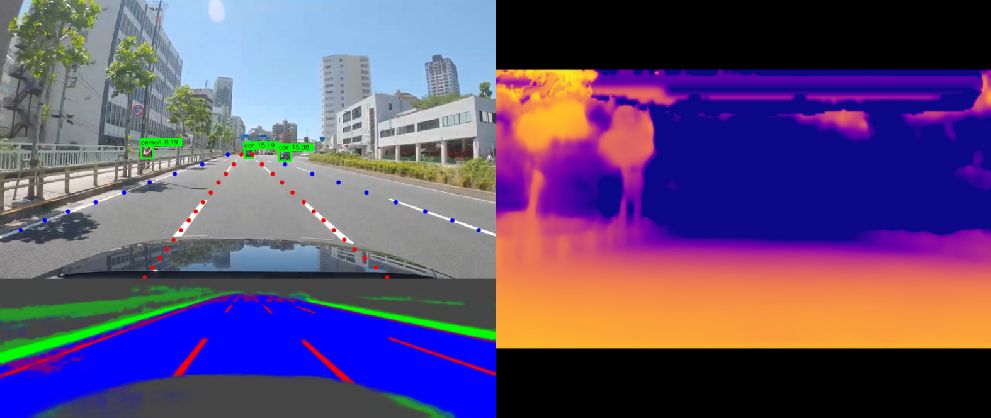
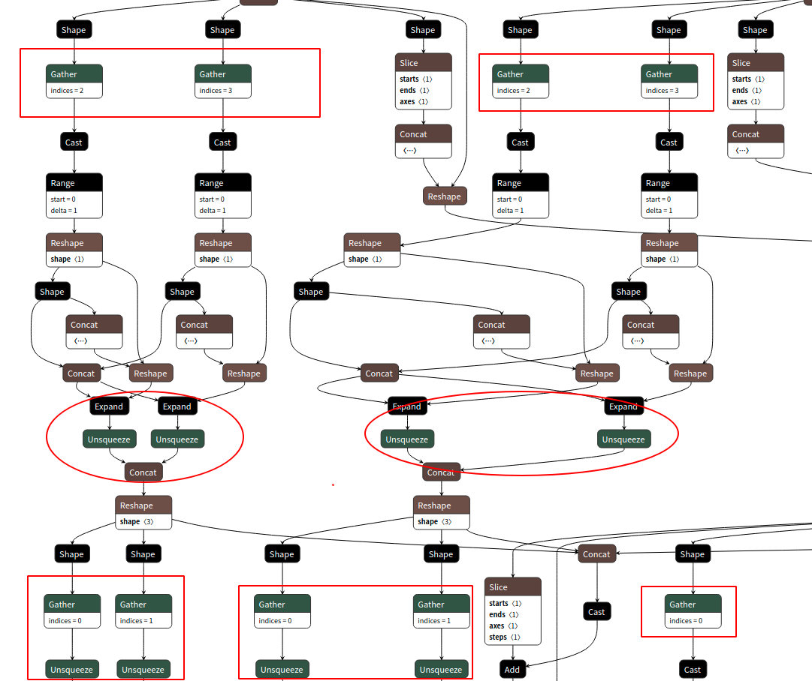
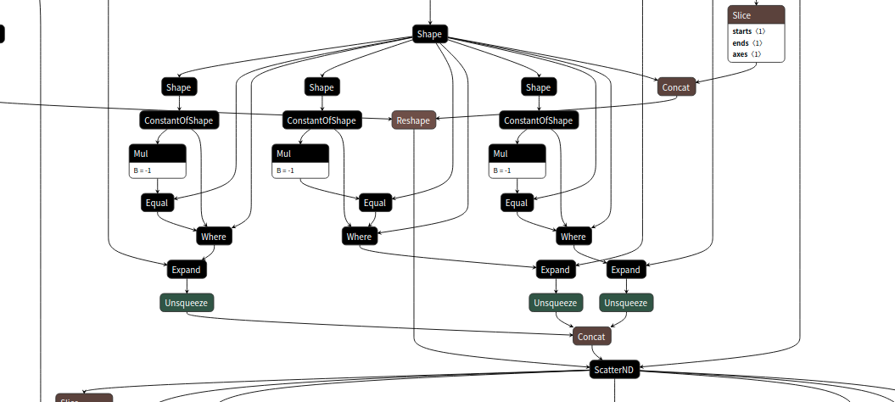
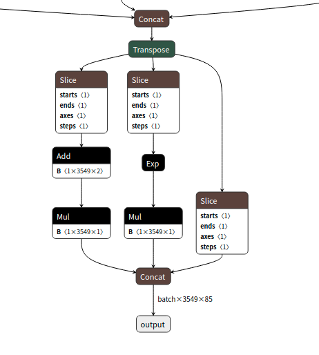
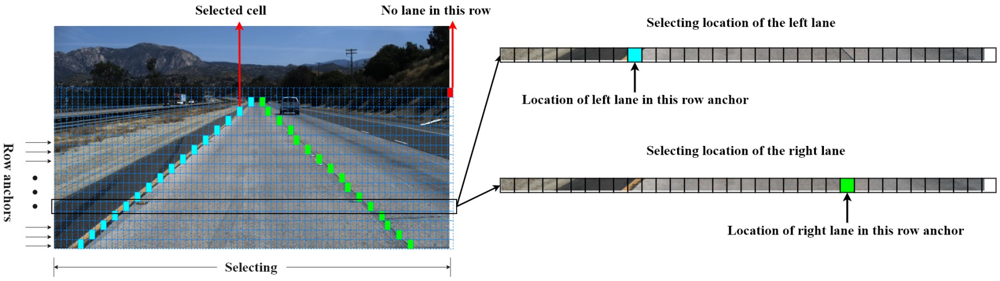
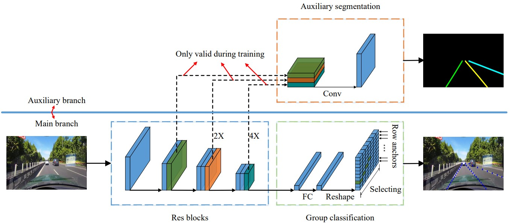
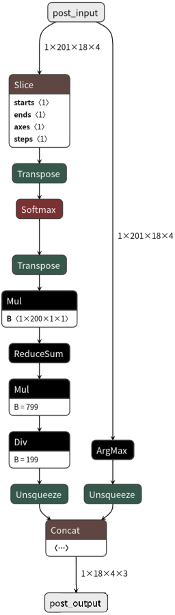
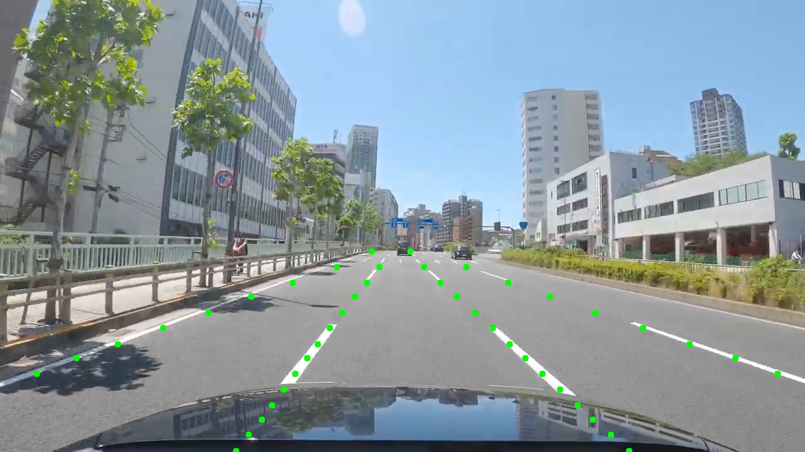
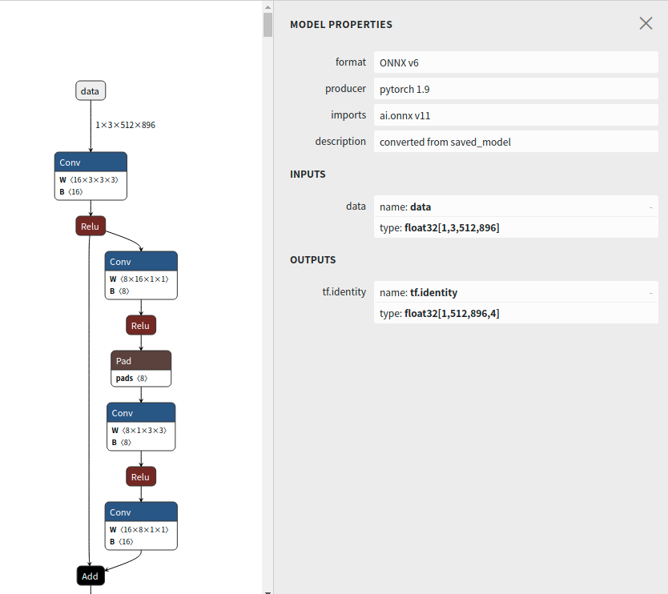
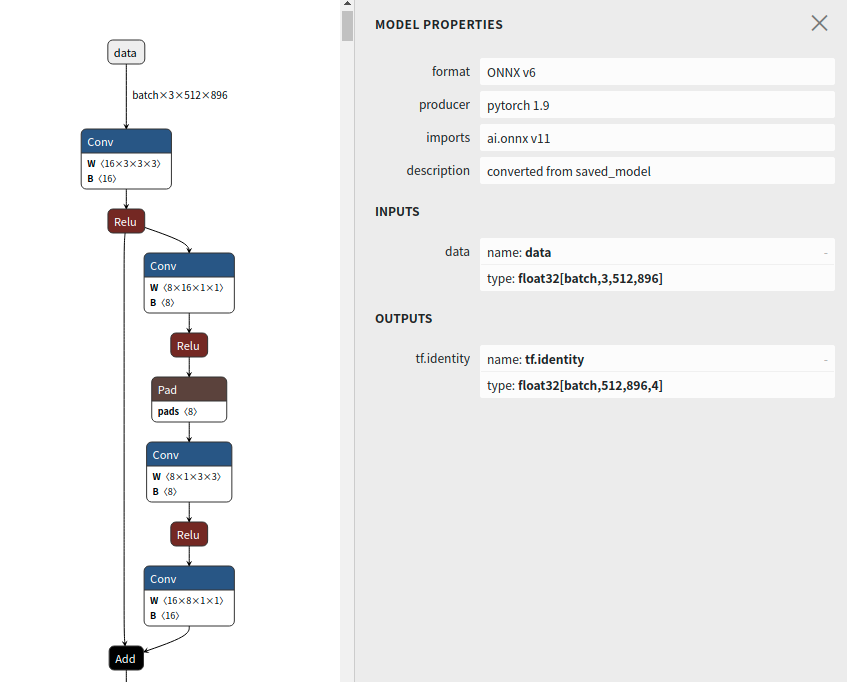

# 0 目录

<a id="chapter1">1.概述</a>

<a id="chapter2">2.车辆检测</a>

<a id="chapter3">3.车道线检测</a>

<a id="chapter4">4.道路分割</a>

<a id="chapter5">5.深度估计</a>

# 1 概述

自动驾驶模型高性能推理封装部署

- 车辆检测
- 车道检测
- 道路分割
- 深度估计



## Performance

| GPU      | TensorRT | CUDA |
| -------- | -------- | ---- |
| GTX 2060 | 8.0.1.6  | 11.5 |

测试方法：

1. 数据集：使用 16 张图像；
2. warmup：使用车辆检测模型推理 16 张图像;
3. 每个模型单独测试：循环推理 16 张图像 100 次；

| Model                                      | 模型输入尺寸 |      FP32 |      FP16 |
| ------------------------------------------ | -----------: | --------: | --------: |
| == Inference time ==                       |              |           |           |
| Object Detection                           |    416 x 416 |   2.58 ms |   0.84 ms |
| Lane Detection                             |    288 x 800 |  3.09 ms |    0.94ms |
| Road Segmentation                          |    512 x 896 |  10.96 ms |    4.2 ms |
| Depth Estimation                           |    256 x 512 | 30.22 ms |   8.59 ms |
| == FPS ==                                  |              |           |           |
| Total (All Model without Depth Estimation) |              | 61.69 fps | 172.5 FPS |

# [2 车辆检测](#chapter2)

## 2.2 预处理

- 输入图像 resize：`[416, 416]`，resize 采用的是 keep Ratio+双线性插值；
- `BGR->RGB`；
- 调整通道：`[B, H, W, C]->[B, C, H, W]`；

三项预处理操作可直接通过一个 warpaffine 放射变换矩阵实现；`warpaffine+cuda`使预处理十分高效。

## 2.3 导出规范的 `onnx`模型文件

### 2.3.1 从官方开源 `YOLOX`导出第一版 `ONNX`

1. 从[`YOLOX`官方开源](https://github.com/Megvii-BaseDetection/YOLOX.git)下载项目，本项目目前使用 `YOLOX-0.2.0`；
2. 下载模型文件 `yolox_nano.pth`；
3. 安装 python 环境：`pip -r ./YOLOX-0.2.0/requirements.txt`；
4. 编辑 `export_yolox.sh`导出 `onnx`文件，bash 脚本如下：

```bash
#!/bin/bash

cd YOLOX-0.2.0
export PYTHONPATH=$PYTHONPATH:.

python tools/export_onnx.py -c yolox_nano.pth -f exps/default/yolox_nano.py --output-name=yolox_nano_v1.onnx --dynamic --no-onnxsim
```

### 2.3.2 调整 `ONNX`

`netron yolo_nano_v1.onnx`可知，`onnx`文件中存在大量 `gather+unsqueeze`结点，其原因是，在 pytorch 模型开发中，直接对 shape 或者 size 进行引用，会产生变量跟踪，导致原始的 onnx 文件中出现冗余结点，影响推理效率；因此，需要对该类变量引用断开梯度跟踪；断开方式是直接对 shape 或者 size 做 int 转换；



```python
# line 206 forward fuction in yolox/models/yolo_head.py. Replace the commented code with the uncommented code
# self.hw = [x.shape[-2:] for x in outputs]
self.hw = [list(map(int, x.shape[-2:])) for x in outputs]


# line 208 forward function in yolox/models/yolo_head.py. Replace the commented code with the uncommented code
# [batch, n_anchors_all, 85]
# outputs = torch.cat(
#     [x.flatten(start_dim=2) for x in outputs], dim=2
# ).permute(0, 2, 1)
proc_view = lambda x: x.view(-1, int(x.size(1)), int(x.size(2) * x.size(3)))
outputs = torch.cat(
    [proc_view(x) for x in outputs], dim=2
).permute(0, 2, 1)
```

继续观察 `onnx`文件，存在 `expand+unsqueeze+cat+scatterND`，整个结构很繁琐，严重影响效率，此结构是由直接对 tensor 做 inplace 操作导致，如：

```python
# line 253 decode_output function in yolox/models/yolo_head.py 解码部分使用了inplace操作
outputs[..., :2] = (outputs[..., :2] + grids) * strides
outputs[..., 2:4] = torch.exp(outputs[..., 2:4]) * strides
```



先使用一个变量进行额外保存+cat 操作，替换 inplace 操作

```python
xy = (outputs[..., :2] + grids) * strides
wh = torch.exp(outputs[..., 2:4]) * strides
return torch.cat((xy, wh, outputs[..., 4:]), dim=-1)
```

重新执行 `export_yolox.sh`导出 `yolox_nano_v2.onnx`经过调整，`onnx`文件很简洁干净；



将 decode 操作尽可能放到 onnx 里，对于 GPU 设备，有利于提高推理速度；

```python
# line 77 in tools/export_onnx.py
model.head.decode_in_inference = True
```

## 2.3.3 推理测试

编辑一个 `yolox_detect_with_onnx.sh`脚本，调用官方自带的 onnxruntime 脚本进行推理，测试检测效果是否满足预期。

```bash
cd YOLOX-0.2.0
export PYTHONPATH=$PYTHONPATH:.

python ./demo/ONNXRuntime/onnx_inference.py \
-m yolox_nano_v1.onnx -i test_image_06.jpg -o ./output --input_shape "416,416"
```

当使用 `model.head.decode_in_inference = True`即在 onnx 中执行解码时，需要关闭 `onnx_inference.py `中的解码部分。

```python
# 注释line 75
# predictions = demo_postprocess(output[0], input_shape, p6=args.with_p6)[0]
predictions = output[0][0] # onnx第0个输出的第一个batch
```

# [3 车道线检测](#chapter3)

## 3.1 概述

[论文：Ultra_Fast_Structure-aware_Deep_Lane_Detection](./paper/Ultra_Fast_Structure-aware_Deep_Lane_Detection.pdf)

车道线检测通过一系列点来表示线，本例中将输出 4 条车道线，即左、右两侧最近的两条；图示仅展示了最近的左侧和右侧；

在 y 方向上，会设定固定等间隔的 row_anchors，若 row_anchors 数量为 18 则表示每条车道线最多由 18 个点表示，其中点的 y 值已设定，仅需预测 x 值；

在 x 方向上，划分为若干间隔 cell，每个 cell 位置概率由模型预测，位置值即为 cell 标号（1 ～ 200），位置概率 `softmax`后和对应位置值加权和即为每个车道线每个 row_anchor 上的 x 值（分类方式实现回归），同时使用额外的一个 cell（no lane in this row），当某个 row_anchor 没有车道线时，输出"人为增加"的 cell 的位置；

若车道线 `row_anchor=18，lane_num=4，cell_num=201`，则 B 帧图像车道线信息可由 `[B, 201, 18 ,4]`张量表示；



## 3.2 模型结构



## 3.2.1 模型结构优势

1. 计算量小，满足检测速度要求：使用分类方式提取车道结构，而非基于图像分割思想提取车道线区域；若图像尺寸 `H*W`，则基于分割方式需要处理 `H*W`个分类，即对每个像素的做分类；而基于分类方式，仅需要做 `h`个分类，只不过分类类别数是 `w+1`，其中 h 为 y 方向 anchor 数量，w 为 x 方向间隔数量，分别远小于 H 和 W，且可人为设定，计算量显著小于分割方式；
2. 模型性能优，模型具有全局感受野，可以适应复杂场景；
3. 结合车道线结构先验信息：考虑相邻 row 车道线相邻点位置连续性，考虑车道线连续多个点斜率的连续性；

### 3.2.2 损失函数

1. ce loss：分类交叉熵损失；
2. similarity loss：相邻 row 分类结果的连续性;
3. shape loss: 车道线连续多个点斜率连续性；

## 3.3 预处理

1. 输入图像 resize：`[288, 800]`；
2. `BGR->RGB`；
3. 标准化：直接除 255；
4. 调整通道：`[B, H, W, C]->[B, C, H, W]`；

## 3.4 后处理

模型输出维度 `[B, 201, 18, 4]`，其中：

- B：`Batch_size`；
- 201：索引 0 ～ 199 值表示位置概率，分别对应位置 1 ～ 200，索引 200 表示车道线点不存在的概率；
- 18：图像在 y 方向被划分为 18 个固定 `row_anchor`；

> [121, 131, 141, 150, 160, 170, 180, 189, 199, 209, 219, 228, 238, 248, 258, 267, 277, 287]

- 4：检测左右最近的 4 条车道线；

后处理步骤：

1. 计算位置

```python
batch_size, x_grid_num, y_grid_num, lane_num = x.shape     #  [B, 201, 18, 4]
prob = softmax(x[:, :x_grid_num-1], dim=1)    # 除最后一项，将前200项位置概率经softmax变换，即位置概率大于0，且和为1
x_grid = torch.arange(1, 201).reshape(1,x_grid_num-1,1,1)    # x方向位置值
x_pre = torch.sum(prob*x_grid, dim=1)    # 位置概率和位置的加权和
```

2. 判断车道线点是否存在

```python
# 若x方向最后一项值最大，表示该车道线检测点不存在；
loc_pre = torch.argmax(x,dim=1)   # [B, 18, 4]，loc_pre==200，车道线检测点不存在；
```

3. 将检测点映射回输入图像；

- 将 x_pre 预测值乘以 cell 宽度；
- 将 x_pre，y 值是相对于 resize 后图像，需要进一步映射回原图；

## 3.5 推理

### 3.5.1 简单推理验证

在 python 端编写前处理和后处理，并通过调用 `onnx`模型进行推理，验证前车道线检测结果是否满足期望；若满足，则表示预处理、后处理、`onnx`模型文件正确；

```bash
python lane_detection/lane_inference_with_onnx.py
```

### 3.5.2 推理模型优化

由于车道检测包含较多后处理操作，因此，为提高检测性能，将后处理尽可能在模型中计算，具体步骤：

1. 将后处理封装成 `class PostProcessModel(torch.nn.Module)`；见 `lane_detection/lane_inference_with_onnx.py`;
2. 将 `PostProcessModel`导出为 `onnx`文件；

```bash
python export_postprocess_to_onnx.py
```



3. 将车道检测模型 `onnx`和后处理 `onnx`进行拼接，合并成一个新的 `onnx`模型文件，并将输入输出设置为动态 batch；

```bash
python merge_detect_and_postprocess.py
```

拼接应注意以下要点:

- 动态 batch：设置输入输出动态 batch，删除 `onnx`中所有 `node`的维度信息；
- 将 `postprocess.onnx`中 `node、initialize`r 拷贝至 `detect.onnx`；

4. 验证拼接后完整的 `onnx`模型文件

```bash
python lane_inference_with_final_onnx.py
```

5. 推理验证



目标检测和跟踪

PINTO_model_zoo

# [4 道路分割](#chapter4)

## 4.1 概述

道路分割将图像划分为四部分区域：

- 可行驶区：driving
- 不可行驶区: no_driving
- 马路牙子: curb

## 4.2 预处理

1. 输入图像 resize：`[512, 896]`；
2. `BGR->RGB`；
3. 标准化：无；
4. 调整通道：`[B, H, W, C]->[B, C, H, W]`；

## 4.3 后处理

输出[1,512,896,4]，4 个通道分别代表不同的区域，将 4 个通道融合成三通道便于存储为 `RGB`图像输出；

```cpp
output_image = np.zeros((512, 896, 3), dtype=np.float32)
output_image[:,:,0] = prob[:,:,0]*70 + prob[:,:,1]*255
output_image[:,:,1] = prob[:,:,0]*70 + prob[:,:,2]*255
output_image[:,:,2] = prob[:,:,0]*70 + prob[:,:,3]*255

cv2.imwrite("workspace/self_driving/output/road_segmentation.jpg", output_image.astype(np.uint))
# cv2.imwrite("workspace/self_driving/output/no_drive_area.jpg", prob[0,:,:,0]*255)
# cv2.imwrite("workspace/self_driving/output/drive_area.jpg", prob[0,:,:,1]*255)
# cv2.imwrite("workspace/self_driving/output/curb.jpg", prob[0,:,:,2]*255)
# cv2.imwrite("workspace/self_driving/output/lane_line.jpg", prob[0,:,:,3]*255)
```

对应 `cuda`加速：

```cpp
static __device__ unsigned char cast(float value){
    return value >= 255 ? 255 : (value < 0 ? 0 : (unsigned char)value);
}

static __global__ void decode_to_mask_kernel(const float* input, unsigned char* output, int edge){

    int position = blockDim.x * blockIdx.x + threadIdx.x;
    if (position >= edge) return;

    const float* p = input + position * 4;
    output[position * 3 + 0] = cast(p[0] * 70 + p[1] * 255 + p[2] * 0 + p[3] * 0);
    output[position * 3 + 1] = cast(p[0] * 70 + p[1] * 0 + p[2] * 255 + p[3] * 0);
    output[position * 3 + 2] = cast(p[0] * 70 + p[1] * 0 + p[2] * 0 + p[3] * 255);
}

```

## 4.4 推理验证


## 4.5 `TensorRT`加速



由图可知，原始 `onnx`文件 batch 维度是固定的 1，为支持 `tensorRT`动态 batch 推理，需要对 `onnx`进行修改；

修改动态 batch 步骤：

1. 修该输入输出 batch 维度固定数值为-1 或字符名称；
2. 只修改输入输出时，onnx 其他结点维度信息并不能随之改变，仍为原始固定数值，与输入输出冲突，此时只需将 onnx.graph 中所有的结点维度信息删除即可，推理时，会根据输入维度自适应；

```bash
python workspace/self_driving/utils/road_segmentation/road_onnx_dynamic_batch_modify.py
```

关键代码：

```python
onnx_file = "workspace/self_driving/model/road_segmentation_512x896_ori.onnx"
road_model = onnx.load(onnx_file)

# 修改batch维度为动态，名称要与原始onnx名称对应上
road_model.graph.input[0].CopyFrom(onnx.helper.make_tensor_value_info("data", 1, ["batch", 3, 512, 896]))
road_model.graph.output[0].CopyFrom(onnx.helper.make_tensor_value_info("tf.identity", 1, ["batch", 512, 896,4]))

# 删除模型中所有node结点的维度信息
while len(road_model.graph.value_info) > 0:
```

修改后 `onnx`如图，batch 维度由 1 变为 batch，且 onnx 文件中已经没有了维度信息；



# [5 深度估计](#chapter5)

## 5.1 概述

深度估计使用 `LDRN (Laplacian Depth Residual Network) `算法;

论文：[`Monocular Depth Estimation Using Laplacian Pyramid-Based Depth Residuals`](https://github.com/tjqansthd/LapDepth-release)，基于拉普拉斯金字塔深度残差的单目深度估计。

## 5.2 预处理

1. resize: `[256,512]`；
2. 标准化：除 255 使像素值变为 `[0,1]`，mean=`[0.485, 0.456, 0.406]`，std=`[0.229, 0.224, 0.225]`；
3. `BGR->RGB`；
4. 调整通道：`[B, H, W, C]->[B, C, H, W]`；

## 5.3 后处理

```python
prob = session.run(["2499"], {"input.1":image})[0] # 取结点输出
prob =  -5*prob[0,0] + 255 # 第一个batch，第一个通道
prob = prob[int(prob.shape[0]*0.18):]
prob = 255-prob  # 越亮越远
```

## 5.4 修改动态 batch

修改输入输出为的动态 batch

```python
import onnx
import onnx.helper

ldrn_onnx = onnx.load("workspace/self_driving/model/ldrn_256x512_ori.onnx")

# 输入输出batch维度设置为动态
ldrn_onnx.graph.input[0].CopyFrom(onnx.helper.make_tensor_value_info("input.1", 1, ["batch", 3,256,512]))
ldrn_onnx.graph.output[0].CopyFrom(onnx.helper.make_tensor_value_info("2489", 1, ["batch", 1, 16,32]))
ldrn_onnx.graph.output[1].CopyFrom(onnx.helper.make_tensor_value_info("2491", 1, ["batch", 1, 32,64]))
ldrn_onnx.graph.output[2].CopyFrom(onnx.helper.make_tensor_value_info("2493", 1, ["batch", 1, 64,128]))
ldrn_onnx.graph.output[3].CopyFrom(onnx.helper.make_tensor_value_info("2495", 1, ["batch", 1, 128,256]))
ldrn_onnx.graph.output[4].CopyFrom(onnx.helper.make_tensor_value_info("2499", 1, ["batch", 1, 256,512]))
ldrn_onnx.graph.output[5].CopyFrom(onnx.helper.make_tensor_value_info("2497", 1, ["batch", 1, 256,512]))

# 除了输入输出外，删除onnx中所有的维度信息，用于支持动态batch
while len(ldrn_onnx.graph.value_info) > 0:
    ldrn_onnx.graph.value_info.pop()

onnx.save(ldrn_onnx, "workspace/self_driving/model/ldrn_256x512.onnx")
```
